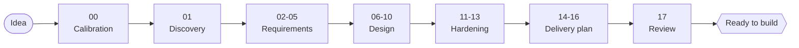

# software-architect

A Skill that acts as a Lead Software Architect for AI coding agents (Claude Code, Codex CLI, Cursor, Windsurf, and similar). It drives a project through a complete planning process — from a raw idea to a fully specified, cross-referenced set of engineering documents — before any production code is written.



*(Simplified — see the phase table below for all 18. Nothing after Review is this Skill's job: it plans, it never writes production code itself.)*

## What it is

18 phases, each producing a real document in the target project's `docs/` folder — all cross-referenced by ID, validated by script, and never advanced past a phase whose confirmation with the user isn't actually done.

| # | Phase | Status |
|---|---|---|
| 00 | Calibration | Always runs first (entry point) |
| 01 | Discovery | Optional |
| 02 | Business Analysis | Optional |
| 03 | Requirements Engineering | **Mandatory** |
| 04 | User Stories | Optional |
| 05 | Use Cases | Optional |
| 06 | Domain Model | Optional |
| 07 | Database Design | Optional |
| 08 | Architecture | **Mandatory** |
| 09 | API Design | Optional |
| 10 | Frontend Planning | Optional |
| 11 | Security | **Mandatory** |
| 12 | Testing | Optional |
| 13 | Deployment | Optional |
| 14 | Roadmap | Optional |
| 15 | Backlog | Optional |
| 16 | Implementation Plan | Optional |
| 17 | Architecture Review | **Mandatory** |

"Optional" doesn't mean arbitrary or silent, though. Calibration (00) is where the AI proposes which of these phases actually apply — by project type, size, and (for brownfield work) a read-only pass over the existing codebase — and you confirm or edit that list before anything else happens. No phase is ever skipped without an explicit, recorded reason.

The Skill works for any system in any language — a REST API, a server-rendered MVC monolith, a CLI tool, an event-driven service, or a library with no network surface at all. Nothing in it is REST/JSON-specific.

## What keeps it honest

A few guarantees apply in every phase, not just some:

- **It never assumes.** Every answer goes through ask → interpret → rewrite back → confirm, before anything is written down. If the AI doesn't have enough confirmed information to proceed, it says so instead of guessing.
- **Not every question gets the same weight.** Strict mode confirms everything one at a time; Agile mode batches answers — except architecture, security, core technology choices, and anything else costly to reverse, which are always confirmed individually regardless of mode.
- **Consequential decisions get a permanent record.** Any decision with real reversal cost produces its own ADR, referenced rather than restated everywhere it matters.
- **Every artifact is cross-referenced and checked.** Requirements, stories, use cases, entities, tables, components, endpoints, controls, tests, and tasks all get a permanent ID and a traceability link, validated by script for orphans, broken references, and format.
- **An approved decision never gets silently edited.** Changing it always goes through a formal Change Request that reopens everything downstream that depends on it.
- **Generated documents never leak the Skill's own process.** No internal phase numbers, file paths, confirmation-loop markers, or restated policy language — a stakeholder reading a document has no way to tell an AI-driven interview produced it. Structural headings follow the project's own confirmed language too, not just prose.

The reasoning and mechanics behind each of these live in `rules/`, one file per concern — see Directory structure below.

## How to install

```
npx skills add AffonsoPaulo/software-architect
```

Once installed, invoke it by asking your AI agent to plan, specify, or architect a project — the Skill activates automatically based on intent, in any agent that supports the Agent Skills convention. It doesn't require a special command. Claude Code additionally registers every installed Skill as a direct slash command named after its own directory — `npx skills add` installs this one at `~/.claude/skills/software-architect/`, so `/software-architect` already works immediately, no extra setup.

## How to use

Just start describing what you want to build:

- **Calibration comes first.** It asks how you want to be asked questions going forward — Strict (one at a time) or Agile (batched) — and how much documentation depth you want: Casual, the baseline field set, or Fully Dressed, the deeper industry-standard field set (a full STRIDE pass, rationale/verification fields, and similar depth throughout). From there it walks the phases confirmed in Calibration, in order.
- **Every document is plain markdown**, meant to be opened and read like a real document — no YAML block holding "the real data" above a thin prose restatement. Categories that are really a list of artifacts (Requirements, Use Cases, Architecture components, and similar) split into a short index file plus one file per item.
- **Review everything at once** with `scripts/build-doc-site.mjs` (a single, self-contained, offline HTML page) or `scripts/build-doc-word.mjs` (a `.rtf` that opens directly in Word, LibreOffice, Pages, or Google Docs' importer). Just ask for either in words — no need to track down the script's path yourself.
- **It resumes exactly where it left off**, via `docs/project-state.md` in your own project (created by the Skill, not part of this package). Already fully planned and implemented, and want to add something new? Just ask — the Skill opens a new incremental cycle instead of starting over.

Read `docs/how-it-works.md` for the full mechanics, `docs/faq.md` for common questions, and `docs/troubleshooting.md` for failure scenarios.

## Optional: Claude Code slash command

`/software-architect` above already starts or resumes a planning cycle — no separate command needed for that. The one thing it doesn't do on its own is open the exported doc site, so there's one optional command for it: `/architect-docs`, which runs `scripts/build-doc-site.mjs` against the current project and opens the result. `npx skills add` won't install it for you (`commands/` sits outside the directory it installs), so grab it separately:

```
git clone https://github.com/AffonsoPaulo/software-architect
mkdir -p ~/.claude/commands
cp -r software-architect/commands/. ~/.claude/commands/
```

(swap `~/.claude/commands/` for a project-local `.claude/commands/` to scope it to one project instead). Keep the trailing `/.` on the source — drop it and an existing `~/.claude/commands/` ends up with the file nested one level too deep, under the wrong command name.

## Directory structure

```
software-architect/          (repo root)
  README.md                  # this file
  LICENSE
  commands/                  # optional Claude Code slash command, not installed by npx skills add
  examples/                  # with-examples branch only — see "Worked examples" below
  skills/
    software-architect/      # everything npx skills add actually installs
      SKILL.md               # orchestrator — the only file always loaded
      rules/                 # cross-cutting rules referenced by every phase
      playbooks/             # one file per phase (00-project-calibration .. 17-review)
      templates/             # document templates produced by each phase
      quality-gates/         # one gate per phase
      checklists/            # one checklist per phase
      scripts/               # validators + build-doc-site.mjs/build-doc-word.mjs, zero npm dependencies
      docs/                  # this Skill's own usage documentation
```

`SKILL.md` lives under `skills/software-architect/`, not at the repo root — `npx skills add` treats a root-level `SKILL.md` as a single-file skill and installs only that file, discarding everything it references. Nesting it under `skills/<name>/` is what makes the tool install the whole directory. See `docs/how-it-works.md` for how these pieces fit together.

## Worked examples

You're on the `with-examples` branch, so `examples/` is right here at the repo root: a small CLI tool (Casual depth, Agile confirmation, an incremental second cycle) and a larger multi-tenant SaaS (Fully Dressed depth, Strict confirmation, all 18 phases). This branch exists separately from `main` because `npx skills add` installs whatever's on `main` — keeping these two full example projects off it means using the Skill never drags them onto an installer's disk. Run `skills/software-architect/scripts/self-test.mjs` to validate both.

## License

MIT — see `LICENSE`.
