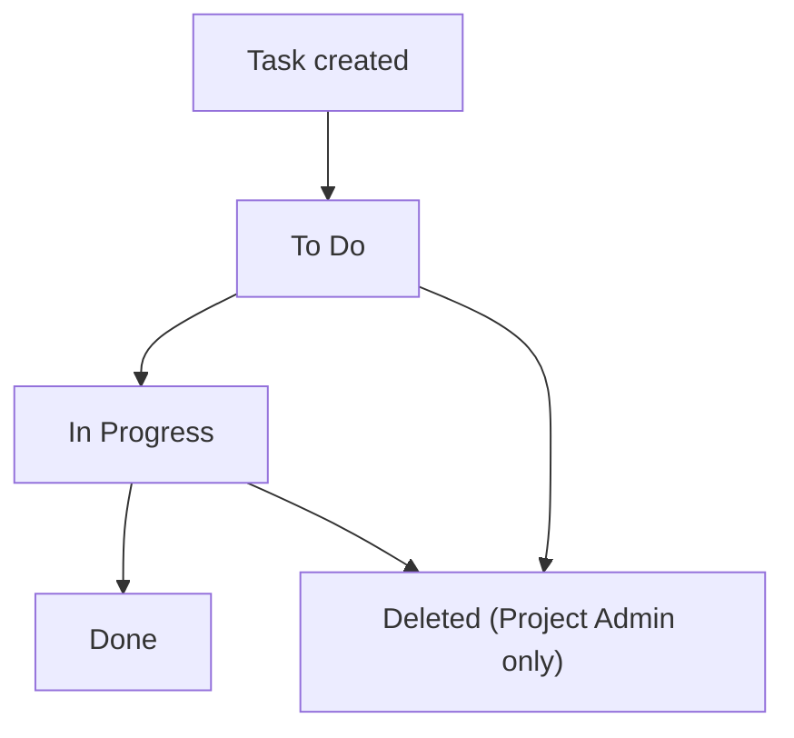

---
business_rules:
  - id: BR-001
    statement: "Only a user with the Project Admin role can delete a task."
  - id: BR-002
    statement: "A task must belong to exactly one project; it cannot exist outside a project or span multiple projects."
---

# Business Analysis

## Business processes

### Task lifecycle
1. A Team Member or Project Admin creates a task within a project, optionally assigning it to a team member.
2. The assignee moves the task through statuses: To Do → In Progress → Done.
3. Any team member can view all tasks in a project, filtered by status or assignee.
4. Only a Project Admin can delete a task (BR-001).

## Actors
- **Project Admin**: can create/assign/delete tasks, manage project membership.
- **Team Member**: can create/assign tasks, update status on tasks assigned to them; cannot delete tasks.

## Business rules
- **BR-001**: Only a Project Admin can delete a task.
- **BR-002**: A task must belong to exactly one project.

## Justification
The design-partner customer explicitly asked for role separation (they don't want every team member able to delete work) and confirmed that cross-project tasks have never been a real need for their workflow — both directly shape BR-001 and BR-002 above, not assumptions.
