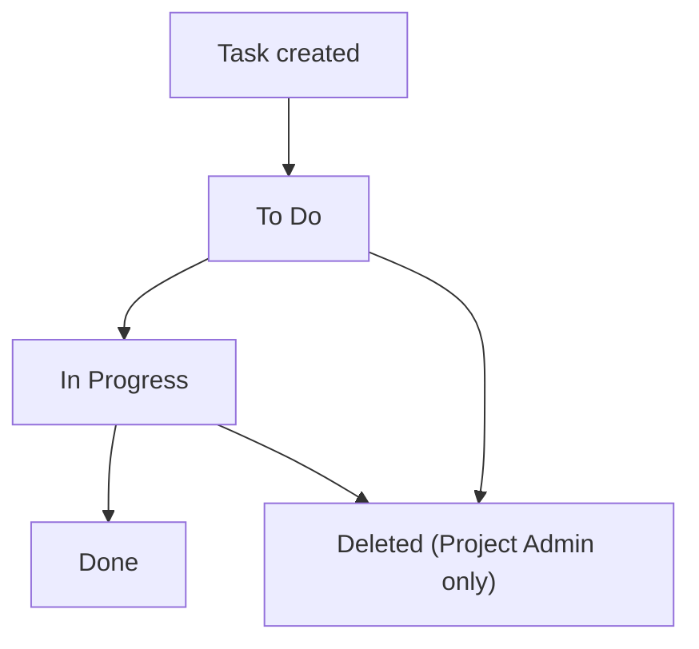

# Business Analysis

## Business processes

### Task lifecycle
1. A Team Member or Project Admin creates a task within a project, optionally assigning it to a team member.
2. The assignee moves the task through statuses: To Do → In Progress → Done.
3. Any team member can view all tasks in a project, filtered by status or assignee.
4. Only a Project Admin can delete a task (BR-001).

### Task lifecycle — To-be
Functionally the same flow as as-is — the design-partner customer confirmed the process itself (create, assign, move through status, admin-only delete) is already correct; what's missing today is a system that enforces it, not a different process. The one behavioral change from today's spreadsheet: status changes become visible to the whole team in real time instead of only when someone remembers to update the shared sheet.

### Task lifecycle — Metrics
| Metric | Current (spreadsheet + Slack) | Target |
|---|---|---|
| Time to find "who owns this task" | Frequently requires asking in Slack, ~5-10 minutes per instance, several times/day | Immediate — visible on the task itself |
| Tasks with a stale/unclear status | Not tracked, but described by the design partner as "common" | Not currently quantifiable pre-launch; tracked post-launch via time-in-status reporting (out of scope for MVP itself) |

### Task lifecycle — RACI
| Step | Responsible | Accountable | Consulted | Informed |
|---|---|---|---|---|
| Create task | Team Member / Project Admin | Project Admin | — | Assignee (if set) |
| Move status | Assignee | Assignee | — | Project Admin |
| Delete task | Project Admin | Project Admin | Assignee | Team Member |

## Actors
- **Project Admin**: can create/assign/delete tasks, manage project membership.
- **Team Member**: can create/assign tasks, update status on tasks assigned to them; cannot delete tasks.

## Business rules

### BR-001 — Task deletion requires Project Admin role
*Traces to: (none) · Author: Priya*

Only a user with the Project Admin role can delete a task.

### BR-002 — A task belongs to exactly one project
*Traces to: (none) · Author: Priya*

A task must belong to exactly one project; it cannot exist outside a project or span multiple projects.

## Pain points
- Finding task ownership costs the design-partner team an estimated 5-10 minutes per lookup, multiple times a day, per their own description — not independently measured, but volunteered unprompted when asked about current pain.
- Status accuracy depends entirely on someone remembering to update the spreadsheet; the design partner could not quantify how often this lapses but characterized it as "common enough that we've stopped trusting the sheet."

## Organizational impact
No new roles are created by this project — Project Admin and Team Member map directly onto how the design-partner customer already organizes their team informally. No training program planned beyond in-app onboarding; the design partner's team lead will informally onboard their own ~30 people.

## Justification
The design-partner customer explicitly asked for role separation (they don't want every team member able to delete work) and confirmed that cross-project tasks have never been a real need for their workflow — both directly shape BR-001 and BR-002 above, not assumptions.
