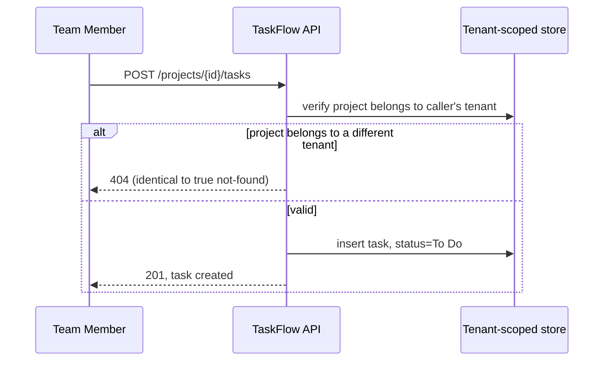

---
use_cases:
  - id: UC-001
    traces_to: ["US-001"]
    primary_actor: "Team Member"
    secondary_actors: ["Project Admin"]
    preconditions:
      - "The actor is authenticated and is a member of the project's tenant."
    postconditions:
      - "A new task exists in the project, in 'To Do' status, visible to all project members."
    main_flow:
      - "Actor opens the project and selects 'New Task'."
      - "Actor enters a title, optional description, and optionally selects an assignee from the project's members."
      - "System validates the project exists and belongs to the actor's tenant."
      - "System creates the task in 'To Do' status."
    alternative_flows:
      - trigger: "At step 3, the project doesn't exist or belongs to a different tenant"
        steps:
          - "System responds identically to a not-found case — no confirmation or denial that reveals another tenant's project exists (per REQ-003)."
      - trigger: "At step 2, the selected assignee isn't a member of the project's tenant"
        steps:
          - "System rejects the assignment with a clear error; the task is not created until a valid assignee (or none) is chosen."
  - id: UC-002
    traces_to: ["US-002"]
    primary_actor: "Team Member"
    secondary_actors: []
    preconditions:
      - "The actor is authenticated and is a member of the project's tenant."
    postconditions:
      - "The actor sees the list of tasks matching the applied filters."
    main_flow:
      - "Actor opens the project's task board."
      - "System loads all tasks belonging to the project, scoped to the actor's tenant."
      - "Actor optionally applies status and/or assignee filters."
      - "System narrows the displayed list to tasks matching all applied filters."
    alternative_flows:
      - trigger: "At step 2, the project has zero tasks"
        steps:
          - "System shows an empty state, not an error."
---

# Use Cases

## UC-001 — Create a task
**Traces to**: US-001
**Primary actor**: Team Member
**Secondary actors**: Project Admin

**Preconditions**:
- Actor is authenticated and a member of the project's tenant.

**Main flow**:
1. Actor opens the project and selects "New Task".
2. Actor enters title, optional description, optionally selects an assignee.
3. System validates the project exists and belongs to the actor's tenant.
4. System creates the task in "To Do" status.

**Alternative/exception flows**:
- At step 3, cross-tenant project access attempt: respond identically to not-found — no existence leak (REQ-003).
- At step 2, assignee outside the project's tenant: rejected with a clear error.

**Postconditions**:
- A new task exists, "To Do" status, visible to the project.

## UC-002 — View and filter tasks
**Traces to**: US-002
**Primary actor**: Team Member

**Preconditions**:
- Actor is authenticated and a member of the project's tenant.

**Main flow**:
1. Actor opens the project's task board.
2. System loads all tasks for the project, scoped to the actor's tenant.
3. Actor optionally applies status/assignee filters.
4. System narrows the list accordingly.

**Alternative/exception flows**:
- At step 2, zero tasks: show empty state, not an error.

**Postconditions**:
- Actor sees the task list matching applied filters.
