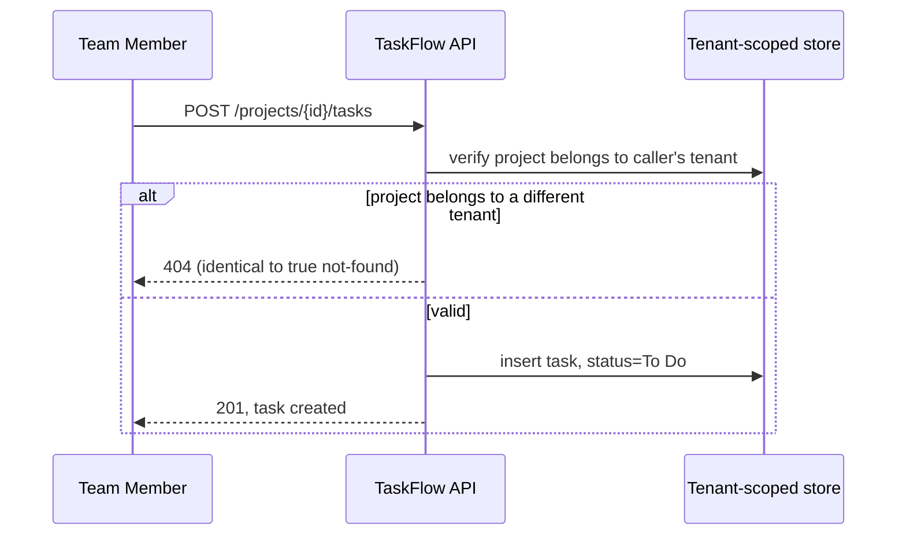

# Use Cases

## UC-001 — Create a task
*Traces to: US-001*

**Goal in context**
Get a piece of identified work recorded against a project so it's visible to the team and assignable — the digital replacement for adding a row to the shared spreadsheet.

**Scope**
The TaskFlow Application Server (ARCH-001), specifically its task-creation path.

**Stakeholders and interests**
| Stakeholder | Interest |
|---|---|
| Team Member (primary actor) | Task is recorded quickly, without friction |
| Project Admin | Task is correctly scoped to their project and tenant, never leaks to or from another tenant |

**Primary actor**: Team Member
**Secondary actors**: Project Admin

**Trigger**: The actor selects "New Task" from within a project they're a member of.

**Preconditions**
- Actor is authenticated and a member of the project's tenant.

**Minimal guarantees**
No task is ever created against a project belonging to a different tenant than the actor's, regardless of how the request is crafted — this holds even if every other step of the flow fails or is retried.

**Main flow**
1. Actor opens the project and selects "New Task".
2. Actor enters title, optional description, optionally selects an assignee.
3. System validates the project exists and belongs to the actor's tenant.
4. System creates the task in "To Do" status.

**Alternative/exception flows**
- At step 3, cross-tenant project access attempt: respond identically to not-found — no existence leak (REQ-003).
- At step 2, assignee outside the project's tenant: rejected with a clear error.

**Success guarantees**
A new task exists, "To Do" status, visible to the project.

**Special requirements**
None beyond the project's general NFRs (REQ-003, REQ-004) — task creation is not itself latency-critical in the way task listing is.

**Technology and data variations**
None — web-only for this release, no channel-specific variation.

**Frequency of occurrence**
Estimated several times per day per active team, based on the design-partner's current spreadsheet-row-add frequency.

**Open issues**
None outstanding.

## UC-002 — View and filter tasks
*Traces to: US-002*

**Goal in context**
See the current state of a project's work at a glance, without asking a teammate — the digital replacement for "check the spreadsheet" or "ask in Slack."

**Scope**
The TaskFlow Application Server (ARCH-001), specifically its task-listing/filtering path.

**Stakeholders and interests**
| Stakeholder | Interest |
|---|---|
| Team Member (primary actor) | Sees an accurate, current, correctly-scoped list quickly |
| Project Admin | Same as Team Member — no privileged view difference for listing |

**Primary actor**: Team Member

**Trigger**: The actor opens a project's task board.

**Preconditions**
- Actor is authenticated and a member of the project's tenant.

**Minimal guarantees**
The list returned never includes a task belonging to a project outside the actor's tenant, regardless of what filters or project ID are supplied.

**Main flow**
1. Actor opens the project's task board.
2. System loads all tasks for the project, scoped to the actor's tenant.
3. Actor optionally applies status/assignee filters.
4. System narrows the list accordingly.

**Alternative/exception flows**
- At step 2, zero tasks: show empty state, not an error.

**Success guarantees**
Actor sees the task list matching applied filters.

**Special requirements**
This use case is where REQ-004's latency target is actually exercised — the query behind step 2 must use the (project_id, status) composite index (`docs/07-database-design/database.md`), not a full scan.

**Technology and data variations**
None — web-only for this release.

**Frequency of occurrence**
Estimated the single most frequent action in the product — every team member opening the board multiple times a day.

**Open issues**
None outstanding.
