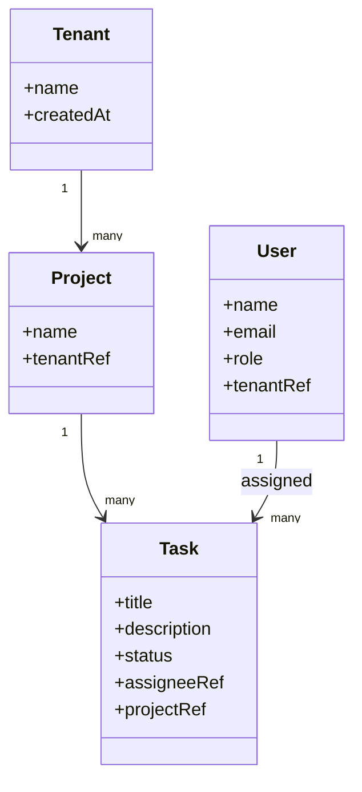

# Domain Model

| ID | Name | Kind | Belongs to aggregate | Traces to |
|---|---|---|---|---|
| [ENT-001](ent-001.md) | Tenant | Entity | itself is the root | UC-001 |
| [ENT-002](ent-002.md) | Project | Entity | itself is the root | UC-001 |
| [ENT-003](ent-003.md) | Task | Entity | ENT-002 | UC-001, UC-002 |
| [ENT-004](ent-004.md) | User | Entity | itself is the root | UC-001 |

## Aggregates
- **Tenant** (ENT-001): its own aggregate, root-level customer boundary.
- **Project** (ENT-002): aggregate root; contains Task (ENT-003) as part of its consistency boundary, confirmed because task status transitions need to be consistent with the project they belong to (e.g. bulk project archival needs to affect all its tasks atomically).
- **User** (ENT-004): its own aggregate, referenced by Task but not owned by Project's aggregate.

## Relationships

## Ubiquitous language
| Term | Meaning |
|---|---|
| Tenant | A customer organization — the unit of data isolation across the whole product |
| Project | A container for related tasks, always scoped to one tenant |
| Task | A unit of trackable work, always scoped to one project |
| Team Member | A user role that can create/assign tasks and update tasks assigned to them |
| Project Admin | A user role that additionally can delete tasks and manage project membership |

## Bounded context notes
Single bounded context for this release — Tenant/Project/Task/User all live in one model with no translation layer between subdomains. Revisit if a future release (e.g. billing, reporting) introduces genuinely different language for the same concepts.

## Domain events
- **TaskCreated**: fired when a task is created; no current subscriber, but recorded here since Deployment's observability plan logs it for per-tenant activity metrics.
- **TaskStatusChanged**: fired on any status transition; same treatment — logged for observability, no functional subscriber yet in this release.

## Example scenario walkthrough
A Team Member at the design-partner's tenant creates a task "Fix homepage typo" in their "Website" project, assigning it to a colleague. ENT-003 (Task) is created with `project_id` pointing to the "Website" Project (ENT-002), which itself carries the design-partner's `tenant_id` (ENT-001). The assignee (ENT-004, User) is validated as belonging to that same tenant before the task is saved — satisfying Task's second invariant. The task starts in "To Do." When the colleague finishes the fix, they move it to "Done" — a valid forward transition per Task's third invariant. If someone later tried to move it back to "To Do," that would violate the invariant and is rejected.
