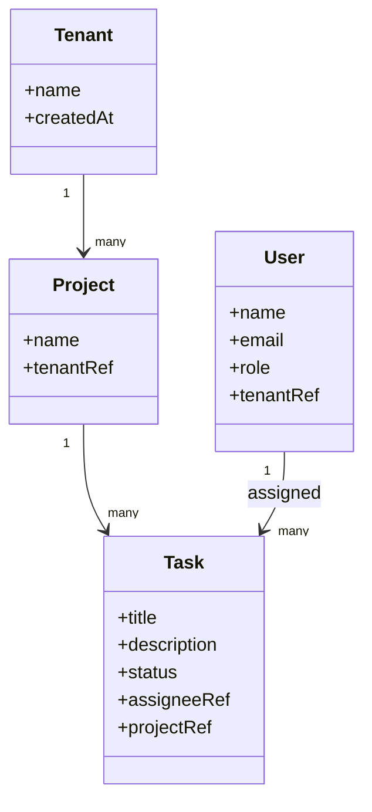

---
entities:
  - id: ENT-001
    kind: "entity"
    traces_to: ["UC-001"]
    attributes: ["name", "created at"]
    invariants:
      - "A tenant's identifier, once assigned, never changes and is never reused, even if the tenant is deactivated."
    aggregate_root: true
    belongs_to_aggregate: null
  - id: ENT-002
    kind: "entity"
    traces_to: ["UC-001"]
    attributes: ["name", "tenant reference"]
    invariants:
      - "A project always belongs to exactly one tenant, set at creation and never changed."
    aggregate_root: true
    belongs_to_aggregate: null
  - id: ENT-003
    kind: "entity"
    traces_to: ["UC-001", "UC-002"]
    attributes: ["title", "description", "status", "assignee reference", "project reference"]
    invariants:
      - "A task always belongs to exactly one project (BR-002)."
      - "A task's assignee, if set, must be a member of the task's project's tenant."
      - "Status transitions only move forward (To Do -> In Progress -> Done) or to Deleted; a Done task cannot silently revert to To Do."
    aggregate_root: false
    belongs_to_aggregate: "ENT-002"
  - id: ENT-004
    kind: "entity"
    traces_to: ["UC-001"]
    attributes: ["name", "email", "role", "tenant reference"]
    invariants:
      - "A user belongs to exactly one tenant — no cross-tenant user accounts (a person on two customer teams needs two separate accounts)."
    aggregate_root: true
    belongs_to_aggregate: null
relationships:
  - from: "ENT-001"
    to: "ENT-002"
    cardinality: "1-to-many"
    description: "A tenant has many projects."
  - from: "ENT-002"
    to: "ENT-003"
    cardinality: "1-to-many"
    description: "A project has many tasks."
  - from: "ENT-004"
    to: "ENT-003"
    cardinality: "1-to-many"
    description: "A user may be assigned to many tasks (optional on the task side)."
---

# Domain Model

## Entities and value objects

### ENT-001 — Tenant
Aggregate root. Represents a customer organization. Identifier is permanent, never reused.

### ENT-002 — Project
Aggregate root. Belongs to exactly one Tenant (ENT-001), set at creation.

### ENT-003 — Task
Belongs to Project's (ENT-002) aggregate — not its own aggregate root. Status only moves forward or to Deleted (never silently reverts).

### ENT-004 — User
Aggregate root. Belongs to exactly one Tenant — no cross-tenant accounts.

## Aggregates
- **Tenant** (ENT-001): its own aggregate, root-level customer boundary.
- **Project** (ENT-002): aggregate root; contains Task (ENT-003) as part of its consistency boundary — `[confirmation individual]`, confirmed because task status transitions need to be consistent with the project they belong to (e.g. bulk project archival needs to affect all its tasks atomically).
- **User** (ENT-004): its own aggregate, referenced by Task but not owned by Project's aggregate.

