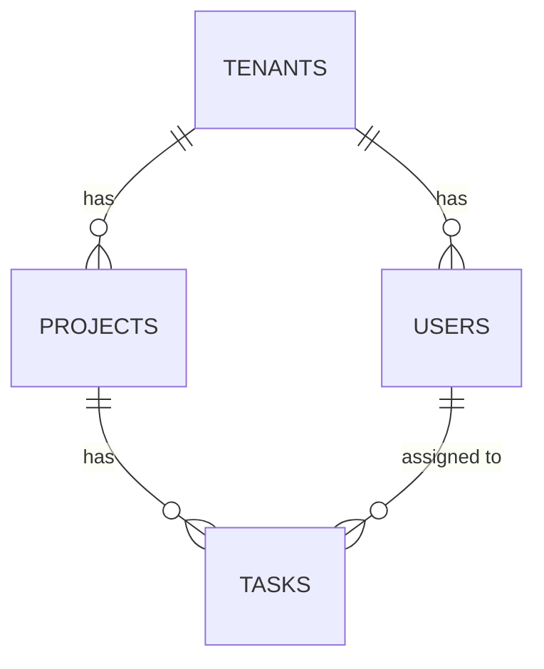

# Database Design

## Database type
Relational (PostgreSQL), confirmed for strong relational integrity across tenants/projects/tasks and mature row-level security support, which Architecture's tenant-isolation approach relies on (see `docs/08-architecture/architecture.md`).

## Tables / collections

| ID | Table | Traces to |
|---|---|---|
| [TBL-001](tbl-001.md) | tenants | ENT-001 |
| [TBL-002](tbl-002.md) | projects | ENT-002 |
| [TBL-003](tbl-003.md) | tasks | ENT-003 |
| [TBL-004](tbl-004.md) | users | ENT-004 |

## Migration strategy
Versioned SQL migrations, applied automatically in CI before deploy.

## Data dictionary
| Table.Column | Business meaning |
|---|---|
| tasks.status | Where the task is in its lifecycle — see ENT-003's invariants for valid transitions (forward-only, or to deleted) |
| projects.tenant_id | The customer organization this project belongs to — the single most important column in the schema for isolation correctness |
| users.role | Project Admin (can delete tasks, manage membership) or Team Member (cannot delete) — see `docs/02-business-analysis/business-analysis.md`'s actor definitions |

## Normalization notes
Standard 3NF throughout, no deliberate denormalization — the dataset per tenant is small enough (tasks numbering in the hundreds to low thousands per project) that join costs are not a concern at this scale, and REQ-004's latency target is met through indexing and read replicas (ARCH-003), not denormalization.

## Retention and archival
No automatic deletion — task and project data is retained indefinitely while a tenant's subscription is active. On tenant offboarding, data is retained for 30 days (in case of accidental cancellation) then permanently deleted, per the compliance stance in `docs/11-security/security.md`.

## Backup and recovery expectations
Daily automated RDS snapshots plus continuous point-in-time recovery (PostgreSQL WAL-based), consistent with Deployment's RPO of under 1 hour (`docs/13-deployment/deployment.md`'s Fully Dressed "Disaster recovery" section).

## Sample / seed data
A fixture set of 2 tenants, 3 projects each, and ~20 tasks per project spanning every status — used in integration tests (per `docs/12-testing/testing.md`'s test data strategy, which requires at least 2 distinct tenants in every run) and for local development.

