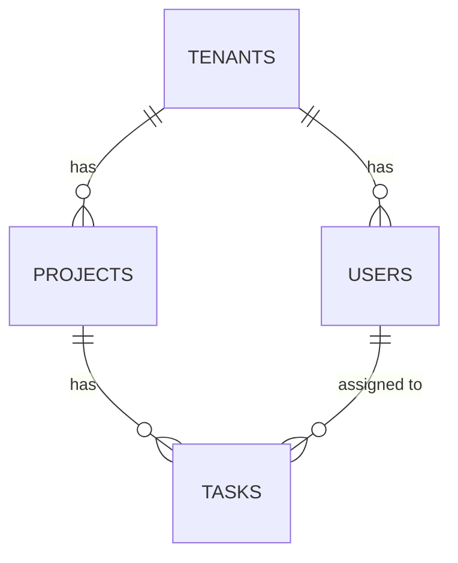

# Database Design

## Database type
Relational (PostgreSQL) — `[confirmation individual]`, confirmed for strong relational integrity across tenants/projects/tasks and mature row-level security support, which Architecture's tenant-isolation approach relies on (see `docs/08-architecture/architecture.md`).

## Tables / collections

### TBL-001 — tenants
*Traces to: ENT-001*

| Column | Type | Constraints |
|---|---|---|
| id | uuid | primary key |
| name | text | not null |
| created_at | timestamptz | not null, default now() |

**Indexes**
None beyond the primary key — tenants are looked up by id only.

### TBL-002 — projects
*Traces to: ENT-002*

| Column | Type | Constraints |
|---|---|---|
| id | uuid | primary key |
| tenant_id | uuid | foreign key -> tenants.id, not null |
| name | text | not null |

**Indexes**
- Index on tenant_id — every project list query is scoped by tenant.

### TBL-003 — tasks
*Traces to: ENT-003*

| Column | Type | Constraints |
|---|---|---|
| id | uuid | primary key |
| project_id | uuid | foreign key -> projects.id, not null |
| title | text | not null |
| description | text | — |
| status | text | not null, check in ('to_do','in_progress','done','deleted') |
| assignee_id | uuid | foreign key -> users.id, nullable |

**Indexes**
- Composite index on (project_id, status) — the task board query filters by both.
- Index on assignee_id — the "my tasks" filter.

### TBL-004 — users
*Traces to: ENT-004*

| Column | Type | Constraints |
|---|---|---|
| id | uuid | primary key |
| tenant_id | uuid | foreign key -> tenants.id, not null |
| email | text | not null, unique per tenant_id |
| role | text | not null, check in ('project_admin','team_member') |

## Migration strategy
Versioned SQL migrations, applied automatically in CI before deploy — `[confirmation individual]`.

## Data dictionary
| Table.Column | Business meaning |
|---|---|
| tasks.status | Where the task is in its lifecycle — see ENT-003's invariants for valid transitions (forward-only, or to deleted) |
| projects.tenant_id | The customer organization this project belongs to — the single most important column in the schema for isolation correctness |
| users.role | Project Admin (can delete tasks, manage membership) or Team Member (cannot delete) — see `docs/02-business-analysis/business-analysis.md`'s actor definitions |

## Normalization notes
Standard 3NF throughout, no deliberate denormalization — the dataset per tenant is small enough (tasks numbering in the hundreds to low thousands per project) that join costs are not a concern at this scale, and REQ-004's latency target is met through indexing and read replicas (ARCH-003), not denormalization.

## Retention and archival
No automatic deletion — task and project data is retained indefinitely while a tenant's subscription is active. On tenant offboarding, data is retained for 30 days (in case of accidental cancellation) then permanently deleted, per the compliance stance in `docs/11-security/security.md`.

## Backup and recovery expectations
Daily automated RDS snapshots plus continuous point-in-time recovery (PostgreSQL WAL-based), consistent with Deployment's RPO of under 1 hour (`docs/13-deployment/deployment.md`'s Fully Dressed "Disaster recovery" section).

## Sample / seed data
A fixture set of 2 tenants, 3 projects each, and ~20 tasks per project spanning every status — used in integration tests (per `docs/12-testing/testing.md`'s test data strategy, which requires at least 2 distinct tenants in every run) and for local development.

