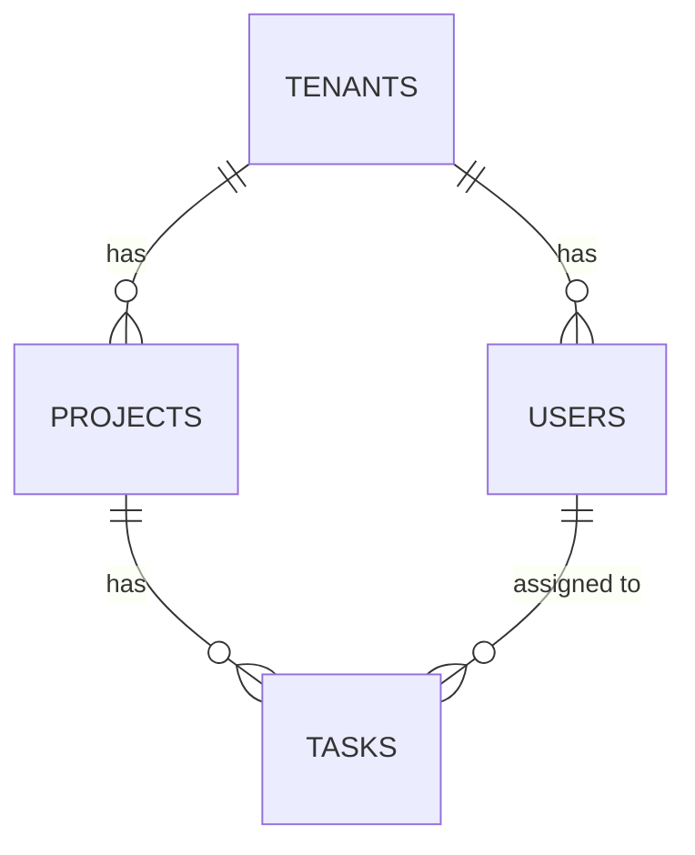

# Database Design

## Database type
Relational (PostgreSQL) — `[confirmation individual]`, confirmed for strong relational integrity across tenants/projects/tasks and mature row-level security support, which Architecture's tenant-isolation approach relies on (see `docs/08-architecture/architecture.md`).

## Tables

See front-matter for full column/constraint detail. Every table traces to its Domain Model entity: `tenants`→ENT-001, `projects`→ENT-002, `tasks`→ENT-003, `users`→ENT-004.

## Migration strategy
Versioned SQL migrations, applied automatically in CI before deploy — `[confirmation individual]`.

