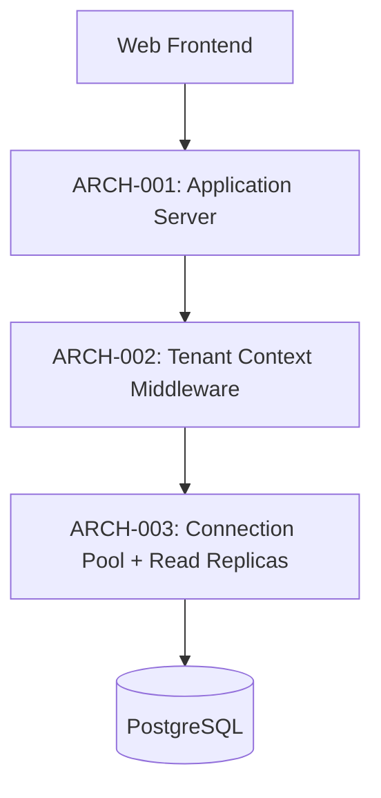

---
components:
  - id: ARCH-001
    name: "Application Server"
    responsibility: "hosts all business logic (projects, tasks, users) as a single deployable modular monolith"
    traces_to: []
    adr: "ADR-001"
  - id: ARCH-002
    name: "Tenant Context Middleware"
    responsibility: "resolves the caller's tenant from their authenticated session on every request and injects it into every database query, so no query can accidentally cross tenant boundaries"
    traces_to: ["REQ-003"]
    adr: "ADR-002"
  - id: ARCH-003
    name: "Connection Pool + Read Replica Layer"
    responsibility: "pools database connections and routes read-heavy queries (task listing) to read replicas to sustain REQ-004's concurrency/latency target"
    traces_to: ["REQ-004"]
interaction_style_guidance: "REST — a single API consumed by the web frontend (phase 10). No public third-party API in this release."
---

# Architecture

## Architectural style
Modular monolith — `[confirmation individual]`. Confirmed given the team's size (small enough that microservices' operational overhead isn't justified yet) and the MVP timeline constraint from Vision. Modularity within the monolith keeps a later split to services possible without a full rewrite.

## Components
### ARCH-001 — Application Server
Hosts all business logic as one deployable unit.

### ARCH-002 — Tenant Context Middleware
Resolves tenant from the authenticated session and injects it into every query — the mechanical enforcement behind REQ-003.

### ARCH-003 — Connection Pool + Read Replica Layer
Addresses REQ-004's concurrency/latency target by pooling connections and routing reads to replicas.

## Core technologies
Node.js + PostgreSQL, deployed on AWS — `[confirmation individual]`. Confirmed based on the team's existing expertise (avoids a ramp-up cost the one-quarter MVP timeline can't absorb).

## Non-functional requirement coverage
| REQ-XXX (NFR) | Addressed by |
|---|---|
| REQ-003 (tenant isolation) | ARCH-002 / ADR-002 |
| REQ-004 (concurrency/latency) | ARCH-003 |

## Interaction style guidance
REST, single API — see front-matter. Phase 09 details the actual endpoints.

