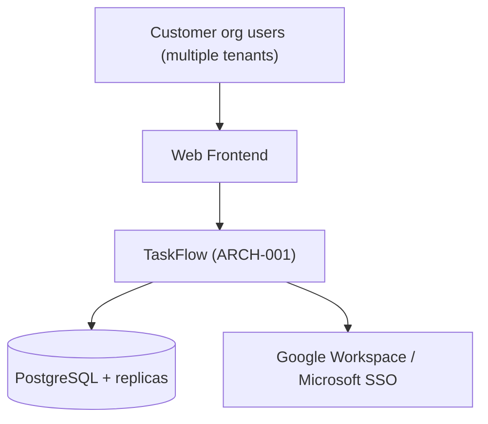
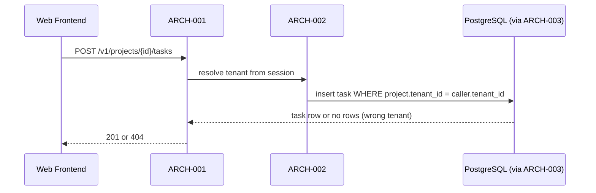
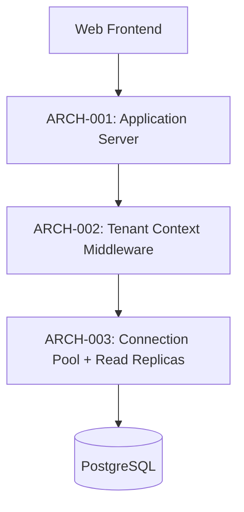

# Architecture

## Architectural style
Modular monolith — `[confirmation individual]`. Confirmed given the team's size (small enough that microservices' operational overhead isn't justified yet) and the MVP timeline constraint from Vision. Modularity within the monolith keeps a later split to services possible without a full rewrite.

## Components

### ARCH-001 — Application Server
*Traces to: (none) · ADR: ADR-001*

Hosts all business logic (projects, tasks, users) as a single deployable modular monolith.

### ARCH-002 — Tenant Context Middleware
*Traces to: REQ-003 · ADR: ADR-002*

Resolves the caller's tenant from their authenticated session on every request and injects it into every database query, so no query can accidentally cross tenant boundaries.

### ARCH-003 — Connection Pool + Read Replica Layer
*Traces to: REQ-004*

Pools database connections and routes read-heavy queries (task listing) to read replicas to sustain REQ-004's concurrency/latency target.

## Core technologies
Node.js + PostgreSQL, deployed on AWS — `[confirmation individual]`. Confirmed based on the team's existing expertise (avoids a ramp-up cost the one-quarter MVP timeline can't absorb).

## Non-functional requirement coverage
| REQ-XXX (NFR) | Addressed by |
|---|---|
| REQ-003 (tenant isolation) | ARCH-002 / ADR-002 |
| REQ-004 (concurrency/latency) | ARCH-003 |

## Interaction style guidance
REST — a single API consumed by the web frontend (phase 10). No public third-party API in this release. Phase 09 details the actual endpoints.

## Context view
The whole system as one box: the web frontend and, indirectly, each customer organization's users, talk only to the Application Server over HTTPS. The Application Server is the only component with a network-facing surface; the database and its replicas are never reachable directly from outside AWS's private network.

## Runtime view
Task creation (UC-001), showing the components collaborating at runtime:

## Crosscutting concepts
- **Logging**: structured JSON, every log line tagged with `tenant_id`, never with PII fields (per `docs/11-security/security.md`'s data classification) — enforced by a shared logging wrapper, not left to each module to remember.
- **Error handling**: every module throws a small set of typed application errors (NotFound, Forbidden, Validation); a single top-level handler in ARCH-001 maps them to the API's standard failure format (`docs/09-api-design/api.md`) — no module formats its own HTTP error response.
- **Configuration**: environment variables for non-secret config, AWS Secrets Manager for everything else (`docs/11-security/security.md`'s secrets strategy) — no config file checked into the repository.

## Quality tree
Tenant isolation (REQ-003) was prioritized above all else, including above the MVP timeline itself — the team agreed no deadline pressure justifies shipping without ARCH-002 and its RLS backing. Latency (REQ-004) was prioritized above further modularity — the "Should have" priority reflects that a slower-than-ideal MVP is recoverable, a tenant-isolation failure is not.

## Risks and technical debt
- **Modular monolith may need to split before the next 10x of tenants**: acknowledged and deliberately deferred (ADR-001) — the module boundaries are kept clean specifically so this split doesn't require a rewrite when it becomes necessary.
- **Single Application Server type for all tenants**: a very large future tenant could still create noisy-neighbor pressure despite ARCH-003's read replicas; revisit with per-tenant resource limits if a specific customer's usage pattern demands it.

## Glossary
- **Read replica**: A read-only copy of the primary database, kept in sync asynchronously, used to offload read-heavy queries (task listing) from the primary.
- **Row-level security (RLS)**: A PostgreSQL feature that restricts which rows a query can see/modify based on a policy evaluated per-row — the second, independent enforcement layer behind REQ-003 (ADR-002).

