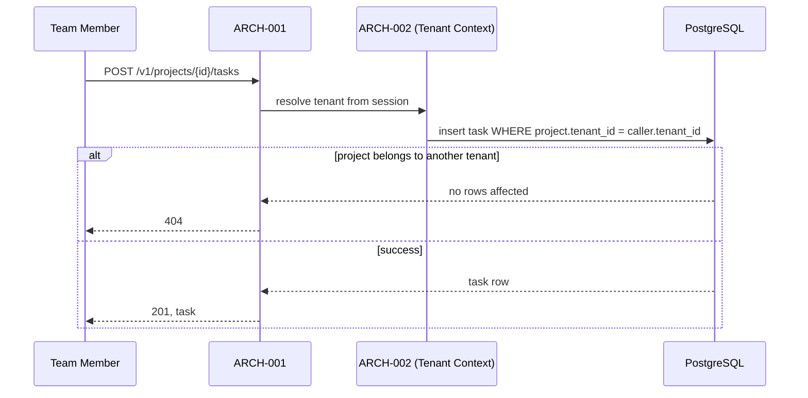

# API Design

## Interaction style
REST, per Architecture's guidance.

## Versioning strategy
URL path versioning (`/v1/...`).

## Failure format
JSON error body with `error.code` and `error.message`, standard HTTP status codes.

## Interactions

### API-001 — Create task
`POST /v1/projects/{projectId}/tasks` — traces to UC-001, ARCH-001.

### API-002 — List/filter tasks
`GET /v1/projects/{projectId}/tasks?status=&assigneeId=` — traces to UC-002, ARCH-001.

Authentication/authorization for both: see `docs/11-security/security.md` — both require an authenticated session; API-001 additionally requires the caller to be a member of the target project's tenant (enforced by ARCH-002, not by the endpoint itself re-checking).

