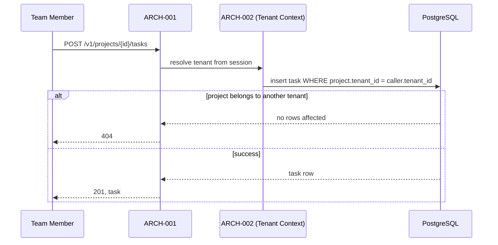

# API Design

## Interaction style
REST, per Architecture's guidance.

## Versioning strategy
URL path versioning (`/v1/...`); breaking changes get a new version prefix.

## Failure format
JSON error body: `{ "error": { "code": string, "message": string } }`, with standard HTTP status codes.

## Interactions

### API-001 — Create task
*Traces to: UC-001, ARCH-001*

**Trigger**: `POST /v1/projects/{projectId}/tasks`

**Input**: title (required), description (optional), assigneeId (optional). projectId from the path, referencing TBL-002; assigneeId references TBL-004.

**Effect/output**: 201, the created task (referencing TBL-003's columns), status `to_do`.

**Failure modes**
- projectId doesn't exist or belongs to another tenant → 404 — identical response either way, per REQ-003, no existence leak
- assigneeId isn't a member of the project's tenant → 422, `error.code = "invalid_assignee"`
- title missing → 422, `error.code = "title_required"`

**Example**
```
POST /v1/projects/9f2a.../tasks
{ "title": "Fix homepage typo", "assigneeId": "3c1b..." }

201 Created
{ "id": "7e4d...", "title": "Fix homepage typo", "status": "to_do", "assigneeId": "3c1b...", "projectId": "9f2a..." }
```

**Rate limiting**
100 requests/minute per authenticated user — returns 429 with `error.code = "rate_limited"` when exceeded. Sized generously above realistic human usage; exists to blunt runaway client bugs, not to throttle normal use.

**Pagination**
Not applicable — a single-resource creation endpoint.

**Deprecation policy**
Project-wide: a deprecated version stays live for 6 months after its successor ships, with a `Sunset` HTTP header added during that window.

**Idempotency**
Not idempotent — calling this twice with the same input creates two tasks. No idempotency key in this release; flagged as a gap to revisit if a customer's integration needs safe retries (currently only the web frontend calls this, which doesn't blind-retry POSTs).

### API-002 — List/filter tasks
*Traces to: UC-002, ARCH-001*

**Trigger**: `GET /v1/projects/{projectId}/tasks?status=&assigneeId=`

**Input**: projectId from the path; status and assigneeId as optional query params.

**Effect/output**: 200, an array of tasks matching the filters, scoped to the caller's tenant (enforced by ARCH-002 regardless of what projectId is passed).

**Failure modes**
- projectId doesn't exist or belongs to another tenant → 404 — identical response either way, per REQ-003

**Example**
```
GET /v1/projects/9f2a.../tasks?status=to_do

200 OK
{ "tasks": [ { "id": "7e4d...", "title": "Fix homepage typo", "status": "to_do", "assigneeId": "3c1b..." } ], "nextCursor": null }
```

**Rate limiting**
Same project-wide policy as API-001 (100 requests/minute per user).

**Pagination**
Cursor-based, `nextCursor` in the response body, default page size 50, max 200. Chosen over offset pagination since task lists can change between page requests (status updates), and cursor pagination avoids skipped/duplicated rows in that case.

**Deprecation policy**
Same project-wide policy as API-001.

**Idempotency**
Inherently idempotent — a read-only query.

Authentication/authorization for both: see `docs/11-security/security.md` — both require an authenticated session; API-001 additionally requires the caller to be a member of the target project's tenant (enforced by ARCH-002, not by the endpoint itself re-checking).


