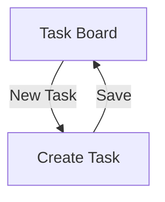

# Frontend Planning

## State management
React Query for server state, component-local state for UI-only concerns.

## Design system
No existing design system — building a small internal component library starting with this project.

## Target platforms
Web only for this release.

## Frontend topology
Single application, matching Architecture's confirmed frontend topology ([Architecture](../08-architecture/architecture.md)) — no divergence.

## Component organization
(none) — only two screens at this stage; no formal organization convention needed yet. Revisit once the screen count grows enough that an ad hoc structure stops being obvious.

## Component inventory
(none) — no component is reused across more than one screen yet. Task Board and Create Task are each self-contained; revisit this table once a genuinely shared component emerges.

## Screens

| ID | Screen | Traces to |
|---|---|---|
| [SCR-001](scr-001.md) | Task Board | UC-002 |
| [SCR-002](scr-002.md) | Create Task | UC-001 |

## Accessibility
Target: WCAG 2.1 AA. Specific focus areas given the product's core interactions: the task board's filter controls and the task-create form must be fully keyboard-navigable, since status updates are a frequent, repetitive action.

## Content and tone guidelines
Plain, direct language matching the product's utilitarian purpose — no marketing tone in-app. Error messages name the specific problem (matches [API Design](../09-api-design/api.md)'s failure format philosophy) rather than generic "something went wrong" text.

## General conventions
Shared baseline across both screens below — each screen's own file only states what genuinely diverges from this (its Empty state, responsive specifics, and analytics events, which differ meaningfully between a list view and a form).

**States**
| State | What the user sees |
|---|---|
| Loading | A skeleton matching the expected layout |
| Error | A clear message naming the problem, with a retry action when applicable; underlying error not shown raw to the user |

## Responsive breakpoints
Mobile: <768px. Tablet: 768–1024px. Desktop: >1024px.

## Navigation

