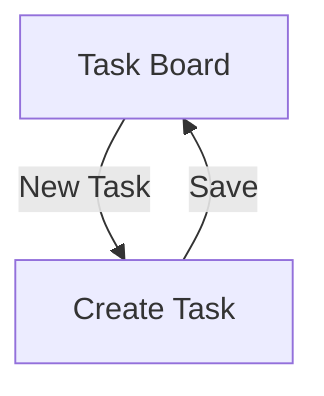

# Frontend Planning

## State management
React Query for server state, component-local state for UI-only concerns.

## Design system
No existing design system — building a small internal component library starting with this project.

## Target platforms
Web only for this release.

## Accessibility
Target: WCAG 2.1 AA. Specific focus areas given the product's core interactions: the task board's filter controls and the task-create form must be fully keyboard-navigable, since status updates are a frequent, repetitive action.

## Content and tone guidelines
Plain, direct language matching the product's utilitarian purpose — no marketing tone in-app. Error messages name the specific problem (matches `docs/09-api-design/api.md`'s failure format philosophy) rather than generic "something went wrong" text.

## Screens

### Task Board
*Traces to: UC-002*

**Calls**: API-002

Shows the filterable task list for a project.

**States**
| State | What the user sees |
|---|---|
| Loading | A skeleton list matching the expected row layout |
| Empty | "No tasks yet — create one to get started," with the New Task action visible |
| Error | "Couldn't load tasks — retry," with a retry button; underlying error not shown raw to the user |

**Responsive behavior**
Single-column task list below the mobile breakpoint (not a primary use case for MVP, but not broken); full table layout at tablet and above.

**Analytics events**
`task_board_viewed` (on load, with project id and applied filters), `task_filter_applied` (on filter change).

### Create Task
*Traces to: UC-001*

**Calls**: API-001

A form/modal for creating a task, reachable from the Task Board.

**States**
| State | What the user sees |
|---|---|
| Loading | Submit button shows a spinner, form fields disabled during submission |
| Empty | Not applicable — the form starts empty by definition |
| Error | Inline field-level errors for validation failures (e.g. missing title); a form-level banner for anything else (e.g. network failure) |

**Responsive behavior**
Full-screen modal below the mobile breakpoint; centered dialog at tablet and above.

**Analytics events**
`task_create_submitted`, `task_create_succeeded`, `task_create_failed` (with the failure's `error.code`).

## Responsive breakpoints
Mobile: <768px. Tablet: 768–1024px. Desktop: >1024px.

## Navigation

