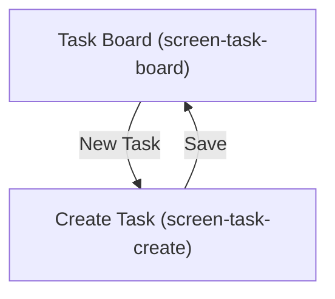

# Frontend Planning

## State management
React Query for server state, component-local state for UI-only concerns — `[confirmation individual]`.

## Design system
No existing design system — building a small internal component library starting with this project — `[confirmation individual]`.

## Target platforms
Web only for this release.

## Screens

### screen-task-board
Traces to UC-002. Calls API-002. Shows the filterable task list for a project.

### screen-task-create
Traces to UC-001. Calls API-001. A form/modal for creating a task, reachable from the Task Board.

## Navigation

