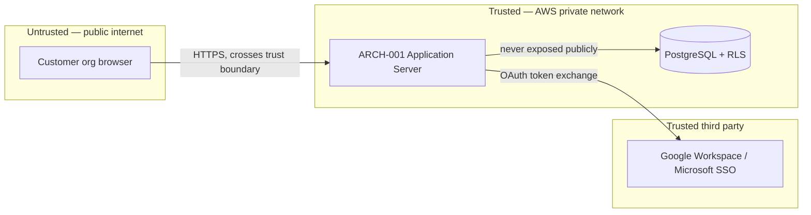

# Security

## Threat model

### ARCH-002 — Tenant Context Middleware
Full STRIDE pass:

| Threat | STRIDE category | Mitigation |
|---|---|---|
| An attacker forges a session to impersonate another tenant's user | Spoofing | SEC-002 (OAuth/SSO, sessions bound to the issuing IdP's tenant claim) |
| A missed tenant-scoping check in a new query lets a request modify another tenant's row | Tampering | SEC-001 |
| A tenant admin denies having deleted data that was actually deleted by their own account | Repudiation | Application audit log records actor + tenant + action for every mutating request (see Observability, `docs/13-deployment/deployment.md`) |
| A missed tenant-scoping check in a new query could leak another tenant's data | Information disclosure | SEC-001 (middleware scoping + RLS as an independent second layer) |
| A single tenant's traffic spike degrades response times for other tenants | Denial of service | ARCH-003's read replicas and connection pooling; monitored via the per-tenant request-volume metric (Deployment) |
| A compromised session token is reused after the legitimate user's access should have ended | Elevation of privilege | Session tokens expire after 24h; SSO logout at the identity provider invalidates the session server-side |

### ARCH-001 — Application Server
| Threat | STRIDE category | Mitigation |
|---|---|---|
| A Team Member calls a Project-Admin-only action directly against the API, bypassing UI-level role checks | Elevation of privilege | SEC-002 (server-side RBAC enforcement, not UI-only) |
| Not applicable | Spoofing | Covered under ARCH-002 above — all authentication flows through the same middleware |
| Not applicable | Tampering | Covered under ARCH-002 above |
| Application-level errors leak stack traces or internal identifiers to the client | Information disclosure | Error handler (Architecture's Crosscutting concepts) returns only the standard failure-format shape, never raw exceptions |
| Not applicable at this layer | Repudiation | Covered by the same audit log as ARCH-002 |
| Not applicable | Denial of service | Covered under ARCH-002/ARCH-003 above |

## Data flow diagram
Trust boundary crossings: (1) the public internet, where any request from a customer org's browser enters; (2) the identity provider boundary, where session assertions are trusted only after OAuth/SSO validation; (3) the database boundary, reachable only from the Application Server within AWS's private network, never directly from the internet.

## Authentication and authorization
OAuth via SSO (Google Workspace, Microsoft). RBAC with Project Admin / Team Member roles.

## Data classification
| Data | Classification | Handling |
|---|---|---|
| Task titles and descriptions | Business-sensitive | Not encrypted beyond standard at-rest database encryption; access controlled entirely by tenant/role scoping (SEC-001, SEC-002) — no special handling beyond that was requested by the design-partner customer. |
| User email addresses | PII | Standard at-rest encryption; never included in logs; only accessible to users within the same tenant. |

## Compliance
GDPR applies (EU-based team members at the design-partner customer). No other frameworks required at launch.

## Secrets strategy
AWS Secrets Manager for database credentials and OAuth client secrets.

## Incident response plan
Engineering lead is the first responder for any suspected cross-tenant data exposure — treated as a Sev1 regardless of confirmed scope, per the "any cross-tenant-access test failure blocks deploy" policy in Deployment. Response: contain (revoke affected sessions/credentials), assess actual scope via the audit log, notify affected tenant(s) within 72 hours if any data was actually exposed (matching GDPR's own notification window), post-mortem written and reviewed before the incident is closed.

## Security testing plan
Dependency scanning (`npm audit` in CI, blocking on high/critical), the automated cross-tenant-access test (TEST-003) run on every CI build, and a manual penetration test commissioned before GA launch specifically targeting tenant-isolation bypass attempts.

## Compliance control mapping
| Regime | Article/control | Addressed by |
|---|---|---|
| GDPR | Art. 17 (right to erasure) | Tenant offboarding process — 30-day retention then permanent deletion (`docs/07-database-design/database.md`) |
| GDPR | Art. 32 (security of processing) | SEC-001, SEC-002, at-rest encryption on PII (user emails) |
| GDPR | Art. 33 (breach notification) | Incident response plan above — 72-hour notification window |

## Controls

| ID | Title | Traces to |
|---|---|---|
| [SEC-001](sec-001.md) | Tenant isolation enforcement | ARCH-002, API-001, API-002 |
| [SEC-002](sec-002.md) | Authentication and role-based authorization | ARCH-001, API-001, API-002 |
