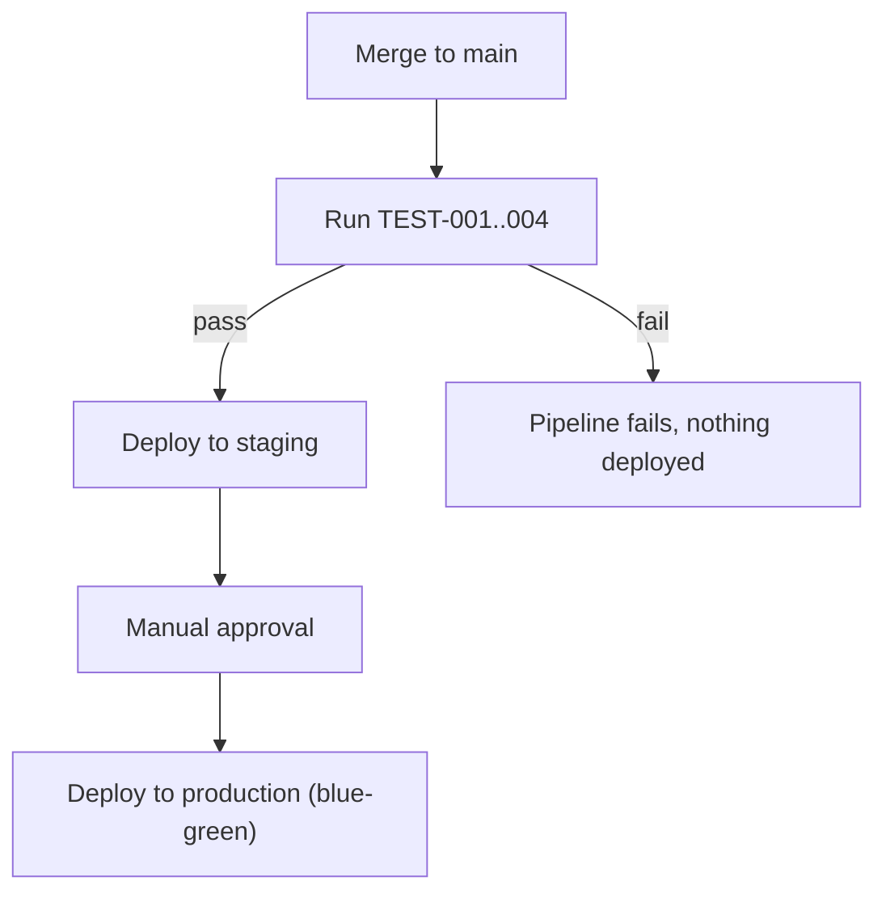

---
environments:
  - name: "dev"
    infrastructure_components:
      - arch_id: "ARCH-001"
        resource: "single small container instance, no autoscaling"
      - arch_id: "ARCH-003"
        resource: "single small RDS PostgreSQL instance, no read replica"
  - name: "staging"
    infrastructure_components:
      - arch_id: "ARCH-001"
        resource: "2 container instances behind a load balancer"
      - arch_id: "ARCH-003"
        resource: "RDS PostgreSQL with 1 read replica, mirrors production topology at smaller scale"
  - name: "production"
    infrastructure_components:
      - arch_id: "ARCH-001"
        resource: "containerized, autoscaling 3-10 instances based on CPU/request rate"
      - arch_id: "ARCH-002"
        resource: "runs in-process within ARCH-001, no separate infrastructure"
      - arch_id: "ARCH-003"
        resource: "RDS PostgreSQL with 2 read replicas, connection pooling via PgBouncer"
provider: "AWS — `[confirmation individual]`"
cicd:
  tool: "GitHub Actions"
  triggers: "on merge to main (deploys to staging automatically), manual approval gate before production"
  pipeline_quality_gates: "all tests pass (TEST-001..004 including the load test), migrations applied successfully in staging first"
rollback_strategy: "Blue-green deployment — the previous container version stays running until the new one passes health checks; a failed rollout automatically routes traffic back to the previous version. Database migrations are written to be backward-compatible for one release, so a rollback never requires a down-migration."
observability:
  logs: "Structured JSON logs shipped to CloudWatch, tagged with tenant_id (never with PII fields, per security.md's data classification) for per-tenant debugging"
  metrics: "Request latency (p50/p95/p99) per endpoint, per-tenant request volume, database connection pool saturation"
  alerts: "p95 latency exceeding 300ms for 5 minutes (REQ-004 threshold), error rate exceeding 1%, any cross-tenant-access test failure in CI blocks deploy entirely rather than alerting post-deploy"
secrets_management: "AWS Secrets Manager — matches docs/11-security/security.md's secrets_strategy exactly, checked explicitly and consistent."
---

# Deployment

## Environments
dev, staging, production — `[confirmation individual]`. Staging mirrors production's topology at smaller scale specifically so REQ-004's load characteristics are testable before production.

## Provider/infrastructure
AWS — `[confirmation individual]`.

## CI/CD pipeline
GitHub Actions: auto-deploy to staging on merge to main, manual approval gate before production, all tests including the load test (TEST-004) must pass first.

## Rollback strategy
Blue-green deployment with backward-compatible migrations for one release — a rollback never needs a down-migration.

## Observability
Structured logs tagged with `tenant_id` (never PII), latency/volume/pool-saturation metrics, alerts on REQ-004's latency threshold and on any cross-tenant-access test failure (which blocks deploy rather than just alerting after the fact).

## Secrets management
AWS Secrets Manager — cross-checked against `docs/11-security/security.md`'s `secrets_strategy` and found consistent (both specify AWS Secrets Manager for database credentials and OAuth client secrets).
