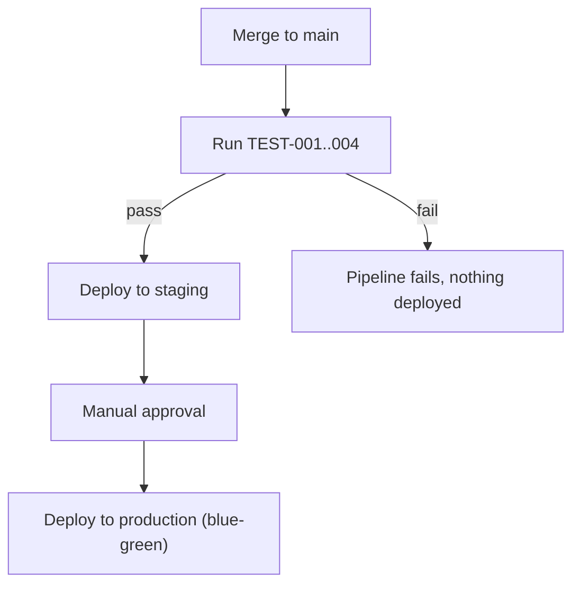

# Deployment

## Environments
dev, staging, production. Staging mirrors production's topology at smaller scale specifically so REQ-004's load characteristics are testable before production.

### dev
ARCH-001: single small container instance, no autoscaling. ARCH-003: single small RDS PostgreSQL instance, no read replica.

### staging
ARCH-001: 2 container instances behind a load balancer. ARCH-003: RDS PostgreSQL with 1 read replica, mirrors production topology at smaller scale.

### production
ARCH-001: containerized, autoscaling 3-10 instances based on CPU/request rate. ARCH-002: runs in-process within ARCH-001, no separate infrastructure. ARCH-003: RDS PostgreSQL with 2 read replicas, connection pooling via PgBouncer.

## Provider/infrastructure
AWS.

## CI/CD pipeline
GitHub Actions: auto-deploy to staging on merge to main, manual approval gate before production, all tests including the load test (TEST-004) must pass first.

## Rollback strategy
Blue-green deployment — the previous container version stays running until the new one passes health checks; a failed rollout automatically routes traffic back to the previous version. Database migrations are written to be backward-compatible for one release, so a rollback never requires a down-migration.

## Observability
**Logs**: Structured JSON logs shipped to CloudWatch, tagged with `tenant_id` (never with PII fields, per `security.md`'s data classification) for per-tenant debugging.
**Metrics**: Request latency (p50/p95/p99) per endpoint, per-tenant request volume, database connection pool saturation.
**Alerts**: p95 latency exceeding 300ms for 5 minutes (REQ-004 threshold), error rate exceeding 1%, any cross-tenant-access test failure in CI blocks deploy entirely rather than alerting post-deploy.

## Secrets management
AWS Secrets Manager — matches `docs/11-security/security.md`'s secrets strategy exactly, checked explicitly and consistent.

## Capacity planning
Autoscaling trigger for ARCH-001: CPU > 70% for 5 minutes, or request queue depth > 50, sustained for 2 minutes. Sized against REQ-004's 500-concurrent-user target with headroom for the "10 customers" growth target in Vision before the next capacity review is needed.

## Disaster recovery
**RTO** (Recovery Time Objective): 4 hours — restore service from the most recent RDS snapshot/PITR and redeploy the last known-good container image.
**RPO** (Recovery Point Objective): under 1 hour — PostgreSQL continuous point-in-time recovery via WAL archiving, consistent with Database Design's backup/recovery expectations.

## Cost estimate
Rough order of magnitude for production at launch scale (10 tenants, ~300 total users): low four figures USD/month (RDS with replicas, container autoscaling floor of 3 instances, CloudWatch). Not a committed budget — order-of-magnitude only, to be refined once real usage patterns are observed post-launch.

## Change management
Any change to production requires: passing CI (including TEST-004), a passing staging deployment, and one engineer's approval on the manual gate before the production deploy proceeds — no direct-to-production deploys, no exceptions for hotfixes (a hotfix still goes through staging, just faster).

## Infrastructure as code
Terraform, stored in the same repository as the application code, applied via the same CI pipeline (plan on PR, apply on merge to main) — kept in sync by construction rather than by manual reconciliation.
