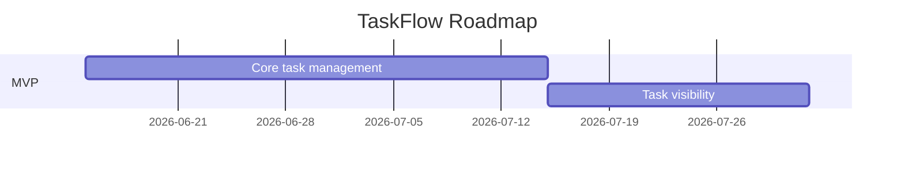

# Roadmap

**Has real dates**: Yes — confirmed with the design-partner customer's onboarding date.

## Milestones

### Milestone 1 — Core task management
*Delivers: US-001, UC-001 · Depends on: (none) · Target date: 2026-07-15*

Team members can create tasks in a project; tenant isolation (REQ-003) verified by TEST-003 passing in CI.

**External dependencies**
The design-partner customer's team lead must complete SSO configuration on their Google Workspace tenant before this milestone can be validated end-to-end with real users.

**Success metrics**
Design-partner team's first 10 tasks created in TaskFlow instead of the spreadsheet, within the first week after this milestone ships to them.

**Milestone risks**
Schedule risk: SSO configuration on the customer's side (external dependency above) is outside the team's control and could slip the validation date even if engineering finishes on time.

### Milestone 2 — Task visibility
*Delivers: US-002, UC-002 · Depends on: Milestone 1 · Target date: 2026-08-01*

Team members can view and filter the task list; load test (TEST-004) passes at 500 concurrent users.

**External dependencies**
None beyond Milestone 1's completion.

**Success metrics**
Design-partner team stops checking the old spreadsheet for task status within 2 weeks of this milestone shipping — confirmed via a follow-up conversation with their team lead, not automated telemetry (out of scope for MVP).

**Milestone risks**
Technical risk: the load test (TEST-004) is new infrastructure (TASK-005) built in the same milestone it's meant to validate — if it slips, the milestone's done criterion can't be verified on schedule.

## Deferred

None.

## Stakeholder communication plan
Weekly async update to the product lead and design-partner team lead via email, summarizing milestone progress against the target dates above; any schedule risk (like the SSO dependency) flagged as soon as it's identified, not held for the weekly update.

