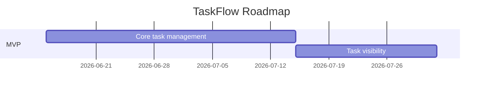

# Roadmap

## Milestones
Real deadline confirmed with the design-partner customer's onboarding date — `has_real_dates: true`.

### Milestone 1 — Core task management (target: 2026-07-15)
Delivers US-001. Done when task creation works end-to-end and TEST-003 (cross-tenant isolation) passes in CI.

### Milestone 2 — Task visibility (target: 2026-08-01)
Delivers US-002. Depends on Milestone 1. Done when filtering works and TEST-004 (load test) passes.

