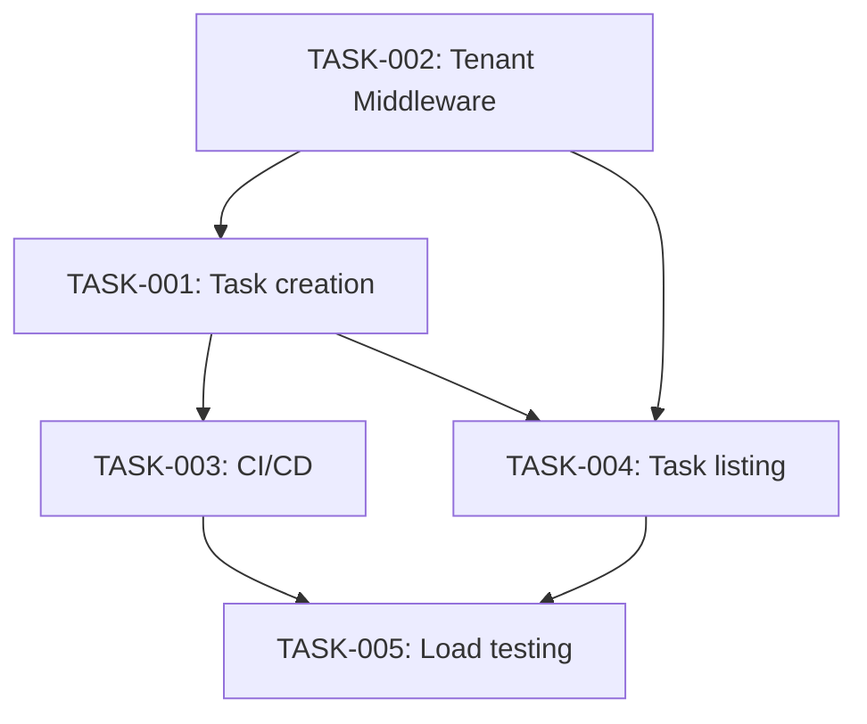

# Implementation Plan

## Definition of Done
Tests pass (unit+integration, and e2e/load where applicable per `docs/12-testing/testing.md`), code reviewed by at least one other engineer, deployed successfully to staging, docs updated.

## Sequence

| Task | Depends on | Parallelizable with | Owner | Estimate |
|---|---|---|---|---|
| TASK-002 | (none) | — | Engineering lead | 8 pts |
| TASK-001 | TASK-002 | — | Engineer A | 5 pts |
| TASK-003 | TASK-001 | — | Engineer B | 3 pts |
| TASK-004 | TASK-001, TASK-002 | TASK-003 | Engineer A | 5 pts |
| TASK-005 | TASK-004, TASK-003 | — | Engineer B | 5 pts |

TASK-002 (Tenant Context Middleware) is first — task creation must be built tenant-safe from the start, not retrofitted. TASK-001 (task creation) depends on TASK-002. TASK-003 (CI/CD pipeline) depends on TASK-001 existing to have something to deploy. TASK-004 (task listing/filtering) depends on TASK-001 and TASK-002; can run in parallel with TASK-003 since they don't touch the same code. TASK-005 (load-testing infra) depends on TASK-004 (needs the listing endpoint to load-test) and TASK-003 (needs the CI pipeline to integrate into).

## Risk mitigation
- **TASK-002 (Tenant Context Middleware)**: highest-risk task in the plan — a subtle bug here undermines REQ-003 project-wide. Mitigation: paired implementation (Engineering lead + one other engineer), plus TEST-003 must pass before this task is considered done, not just before the milestone closes.
- **TASK-005 (load-testing infra)**: risk that k6 scripting takes longer than estimated, since the team hasn't used it before. Mitigation: scheduled early enough in Milestone 2 that a delay here doesn't silently become the milestone's critical-path blocker without visibility.

## Critical path
TASK-002 → TASK-001 → TASK-004 → TASK-005. TASK-003 has slack (it can run parallel to TASK-004), so it is not on the critical path despite being a Milestone 1 item — a delay in TASK-003 alone does not delay the roadmap's target dates, but a delay anywhere on the critical path does.

