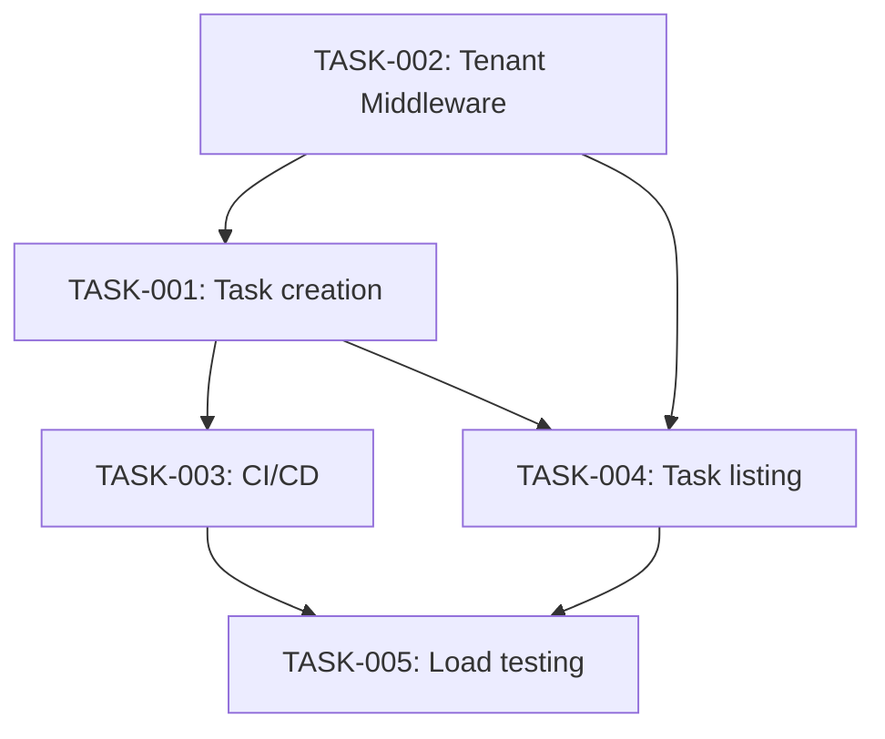

# Implementation Plan

## Definition of Done
Tests pass, code reviewed, deployed to staging successfully, docs updated.

## Sequence
1. TASK-002 (Tenant Context Middleware) — first; task creation must be built tenant-safe from the start, not retrofitted.
2. TASK-001 (task creation) — depends on TASK-002.
3. TASK-003 (CI/CD pipeline) — depends on TASK-001 existing to have something to deploy.
4. TASK-004 (task listing/filtering) — depends on TASK-001 and TASK-002; can run in parallel with TASK-003 since they don't touch the same code.
5. TASK-005 (load-testing infra) — depends on TASK-004 (needs the listing endpoint to load-test) and TASK-003 (needs the CI pipeline to integrate into).

