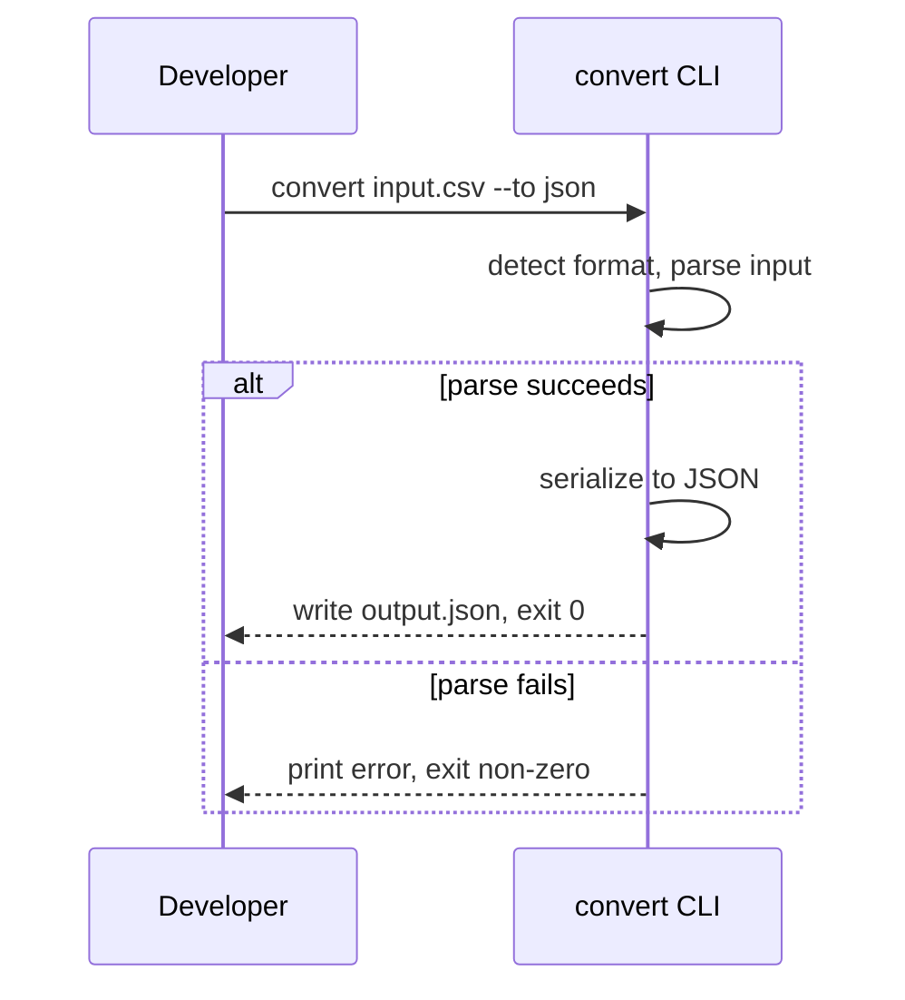

# UC-001 — Convert file between CSV and JSON
*Traces to: US-001*

| Field | Value |
|---|---|
| Primary actor | developer |
| Secondary actors | (none) |

**Preconditions**
- The input file exists and is readable.

**Main flow**
1. Developer runs `convert <input-file> --to <format>`.
2. Tool detects the input format from the file extension (or an explicit `--from` flag).
3. Tool parses the input file into its internal representation.
4. Tool serializes the internal representation into the target format.
5. Tool writes the output file.

**Alternative/exception flows**
| Step | Condition | Result |
|---|---|---|
| 3 | Input file is malformed | Print a specific parse error and exit non-zero; no output file written. |
| 4 | Data can't be represented in the target format | Print an error naming the structure and exit non-zero; no output file written. |

**Postconditions**
- The output file exists, containing the converted data in the target format.

