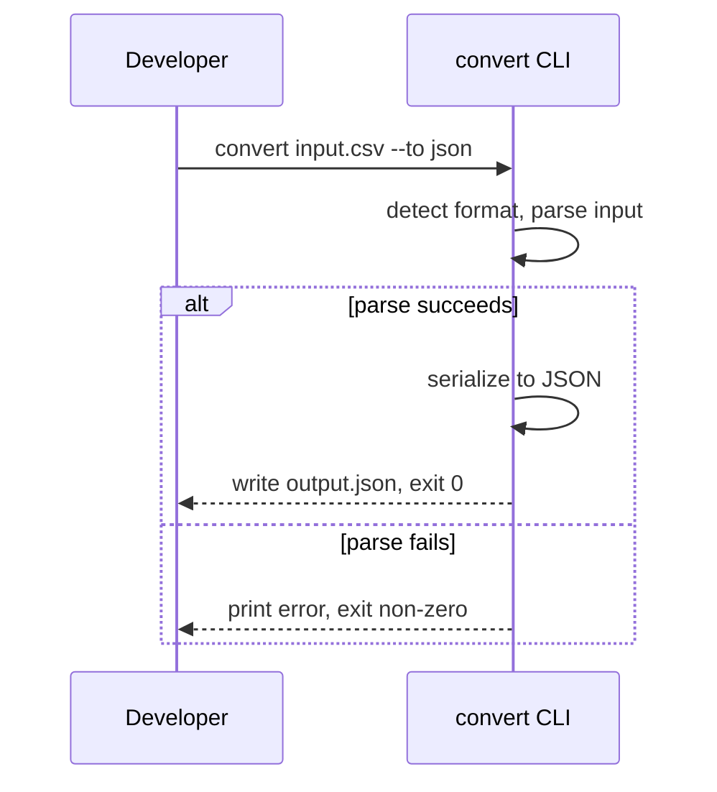

# Use Cases

## UC-001 — Convert file between CSV and JSON
*Traces to: US-001*

**Primary actor**: developer

**Preconditions**
- The input file exists and is readable.

**Main flow**
1. Developer runs `convert <input-file> --to <format>`.
2. Tool detects the input format from the file extension (or an explicit `--from` flag).
3. Tool parses the input file into its internal representation.
4. Tool serializes the internal representation into the target format.
5. Tool writes the output file.

**Alternative/exception flows**
- At step 3, if the input file is malformed: print a specific parse error and exit non-zero; no output file written.
- At step 4, if the data can't be represented in the target format: print an error naming the structure and exit non-zero; no output file written.

**Postconditions**
- The output file exists, containing the converted data in the target format.

## UC-002 — Convert file involving YAML (cycle 2)
*Traces to: US-002*

**Primary actor**: developer

**Preconditions**
- The input file exists and is readable.

**Main flow**
1. Developer runs `convert <input-file> --to <format>` where input or target format is YAML.
2. Tool parses YAML into the same internal representation used for CSV/JSON.
3. Tool serializes to the target format.
4. Tool writes the output file.

**Alternative/exception flows**
- At step 2, if the YAML uses an unsupported feature: print an error naming the feature and exit non-zero; no output file written.

**Postconditions**
- The output file exists, containing the converted data in the target format.
