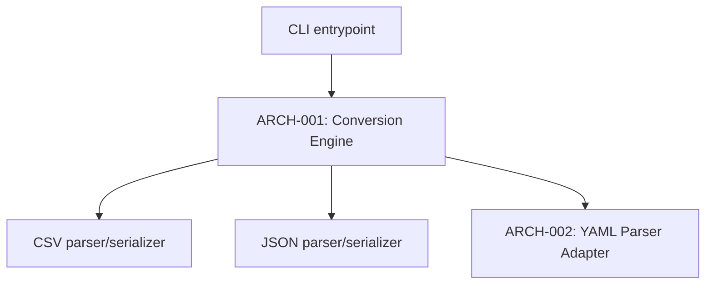

# Architecture

## Architectural style
Single-process CLI binary, no client-server split, no persistence layer — `[confirmation individual]`, confirmed given the project's small size and the constraint of "no runtime to install beyond what's already there."

## Architectural pattern
Pipe-and-filter — `[confirmation individual]`. Input is parsed into a shared internal representation (a stream of flat records), then serialized to the target format; format-specific adapters (CSV/JSON, and YAML in cycle 2) plug into that shared representation rather than converting directly between formats. Already implied by ADR-001's streaming decision and ARCH-002's description — no separate ADR needed for the pattern itself.

## Components

| ID | Component | Traces to | ADR |
|---|---|---|---|
| [ARCH-001](arch-001.md) | Conversion Engine | REQ-002 | ADR-001 |
| [ARCH-002](arch-002.md) | YAML Parser Adapter (cycle 2) | (none) | — |

## Core technologies
Node.js (matches the target developer machines, which already have it installed) — `[confirmation individual]`.

## Non-functional requirement coverage
| REQ-XXX (NFR) | Addressed by |
|---|---|
| REQ-002 (memory bound) | ARCH-001 / ADR-001 |

## Interaction style guidance
CLI command surface — a single executable with subcommands/flags, not an HTTP API. No client-server boundary at all. Phase 09 details the actual command/flags.

