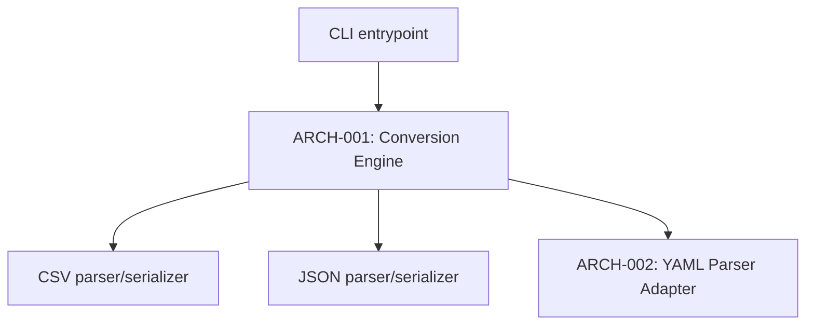

# Architecture

## Architectural style
Single-process CLI binary, no client-server split, no persistence layer — `[confirmation individual]`, confirmed given the project's small size and the constraint of "no runtime to install beyond what's already there."

## Components

### ARCH-001 — Conversion Engine
*Traces to: REQ-002 · ADR: ADR-001*

Parses an input format into an internal representation (a stream of flat records) and serializes it to a target format. Streams rather than loading the whole file into memory, to satisfy REQ-002.

### ARCH-002 — YAML Parser Adapter (cycle 2)
*Traces to: (none)*

Parses/serializes YAML into the same internal representation ARCH-001 already uses — added without changing ARCH-001's shape, since the internal representation was already format-agnostic.

## Core technologies
Node.js (matches the target developer machines, which already have it installed) — `[confirmation individual]`.

## Non-functional requirement coverage
| REQ-XXX (NFR) | Addressed by |
|---|---|
| REQ-002 (memory bound) | ARCH-001 / ADR-001 |

## Interaction style guidance
CLI command surface — a single executable with subcommands/flags, not an HTTP API. No client-server boundary at all. Phase 09 details the actual command/flags.

