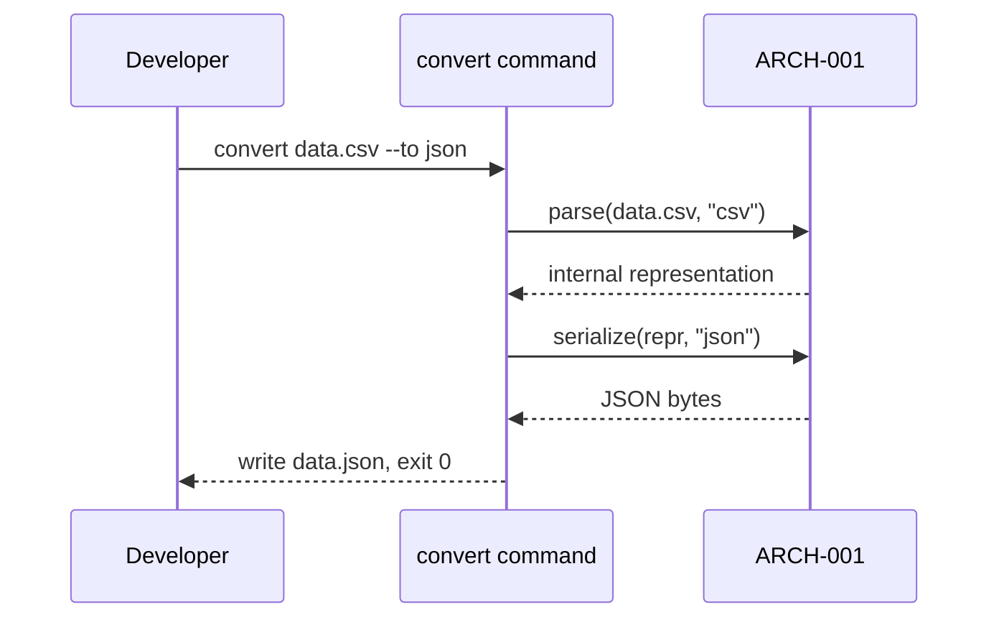

# API-001 — `convert` command (CSV/JSON)
*Traces to: UC-001, ARCH-001*

**Trigger**: `convert <input-file> --to <format> [--from <format>] [--output <path>]`

**Input**: input-file: path to an existing, readable file. `--to`: target format (csv|json). `--from`: optional, inferred from extension if omitted. `--output`: optional, defaults to input filename with the target extension.

**Effect/output**: Writes the converted file to the output path and exits 0. Prints a one-line success summary to stdout (input format, output format, record count).

**Failure modes**
- Input file doesn't exist or isn't readable → exit 1, stderr: `cannot read <path>: <reason>`
- Input file is malformed for its detected/declared format → exit 2, stderr: parse error with line/column if available
- Data can't be represented in the target format → exit 3, stderr: names the specific structure that couldn't convert

