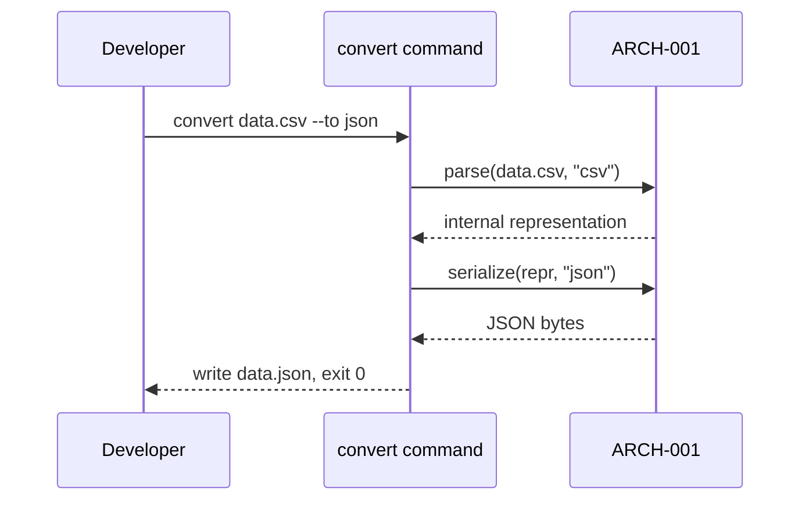

# API Design

## Interaction style
CLI command surface, per Architecture's guidance — a single `convert` command with flags, no separate contract format needed since there's no network boundary.

## Versioning strategy
Semantic versioning on the package itself.

## Failure format
Non-zero exit code + a specific stderr message. No output file written on any failure path.

## Interactions

### API-001 — `convert` command (CSV/JSON)
**Trigger**: `convert <input-file> --to <format> [--from <format>] [--output <path>]`
**Traces to**: UC-001, ARCH-001

### API-002 — `convert` command, YAML option (cycle 2)
**Trigger**: `convert <input-file> --to yaml` (extends API-001's format options, doesn't introduce a new command)
**Traces to**: UC-002, ARCH-002

