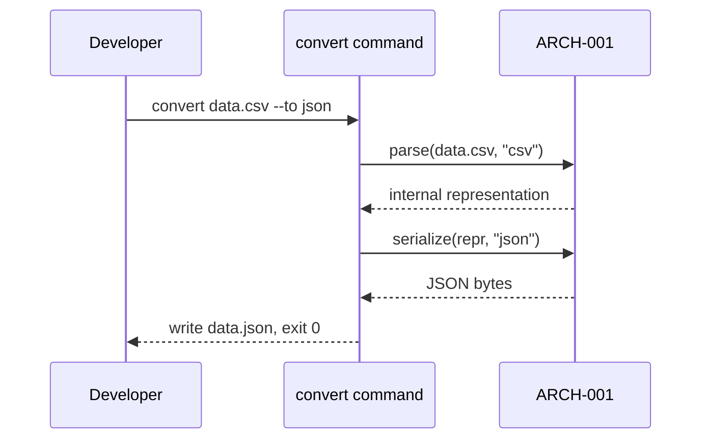

# API Design

## Interaction style
CLI command surface, per Architecture's guidance — a single `convert` command with flags, no separate contract format needed since there's no network boundary.

## Versioning strategy
Semantic versioning on the package itself; no per-command versioning needed for a single-binary CLI.

## Failure format
Non-zero exit code, human-readable error message on stderr naming the specific problem. No output file is written on failure.

## Interactions

### API-001 — `convert` command (CSV/JSON)
*Traces to: UC-001, ARCH-001*

**Trigger**: `convert <input-file> --to <format> [--from <format>] [--output <path>]`

**Input**: input-file: path to an existing, readable file. `--to`: target format (csv|json). `--from`: optional, inferred from extension if omitted. `--output`: optional, defaults to input filename with the target extension.

**Effect/output**: Writes the converted file to the output path and exits 0. Prints a one-line success summary to stdout (input format, output format, record count).

**Failure modes**
- Input file doesn't exist or isn't readable → exit 1, stderr: `cannot read <path>: <reason>`
- Input file is malformed for its detected/declared format → exit 2, stderr: parse error with line/column if available
- Data can't be represented in the target format → exit 3, stderr: names the specific structure that couldn't convert

### API-002 — `convert` command, YAML option (cycle 2)
*Traces to: UC-002, ARCH-002*

**Trigger**: `convert <input-file> --to yaml` (extends API-001's `--to`/`--from` options with `yaml`, doesn't introduce a new command)

**Input**: Same shape as API-001; `--to`/`--from` now also accept `yaml`.

**Effect/output**: Same as API-001, for the YAML direction.

**Failure modes**
- YAML uses an unsupported feature (anchors, multi-document) → exit 4, stderr: names the specific unsupported feature

