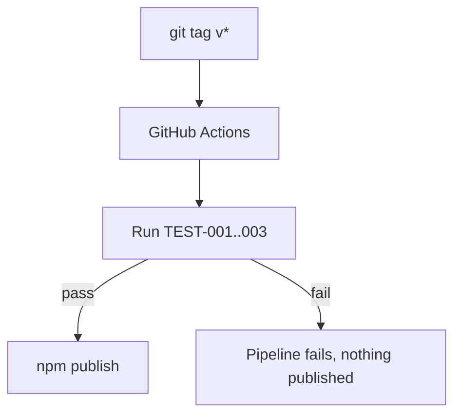

---
environments:
  - name: "npm registry (distribution, not a runtime environment)"
    infrastructure_components: []
    # ARCH-001 and ARCH-002 run entirely on the developer's own machine —
    # there is no hosted infrastructure for either. The only "environment"
    # is the package registry the binary is distributed through.
provider: "npm public registry — `[confirmation individual]`"
cicd:
  tool: "GitHub Actions"
  triggers: "on tag push matching v*"
  pipeline_quality_gates: "all tests pass (TEST-001..003), lint clean"
rollback_strategy: "npm deprecate on the bad version, publish a corrected patch version — no server-side rollback needed since there's nothing hosted."
observability:
  logs: "not applicable — a local CLI has no centralized logging; errors go to the invoking terminal's stderr"
  metrics: "npm download counts, as a rough usage signal — not operational monitoring"
  alerts: "none — no hosted service to alert on"
secrets_management: "npm publish token stored as a GitHub Actions repository secret; matches security.md's secrets_strategy (not applicable to the tool itself, but the publish token is a real secret handled by standard CI secret storage)"
---

# Deployment

## Environments
No traditional dev/staging/production split — `[confirmation individual]`, confirmed given there's no hosted service. The only "environment" is the npm registry the package is published to.

## Provider/infrastructure
npm public registry — `[confirmation individual]`.

## CI/CD pipeline
GitHub Actions, triggered on version tags, running the test suite before publishing.

## Rollback strategy
`npm deprecate` the bad version, publish a corrected patch — there's no server-side state to roll back.

## Observability
No centralized logging or alerting — a local CLI's errors go straight to the user's terminal. npm download counts are the only usage signal, and they're not operational monitoring.

## Secrets management
The npm publish token is a GitHub Actions repository secret — consistent with `docs/11-security/security.md`'s `secrets_strategy` (the tool itself has no secrets; this is a CI-only concern, checked and found non-contradictory).
