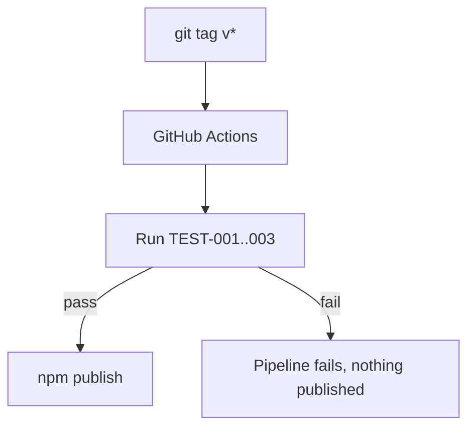

# Deployment

## Environments
No traditional dev/staging/production split — `[confirmation individual]`, confirmed given there's no hosted service. The only "environment" is the npm registry the package is published to; ARCH-001 and ARCH-002 run entirely on the developer's own machine.

## Provider/infrastructure
npm public registry — `[confirmation individual]`.

## CI/CD pipeline
GitHub Actions, triggered on version tags (`v*`), running the test suite before publishing. Quality gates: all tests pass (TEST-001..003), lint clean.

## Rollback strategy
`npm deprecate` the bad version, publish a corrected patch — there's no server-side state to roll back.

## Observability
**Logs**: Not applicable — a local CLI has no centralized logging; errors go to the invoking terminal's stderr.
**Metrics**: npm download counts, as a rough usage signal — not operational monitoring.
**Alerts**: None — no hosted service to alert on.

## Secrets management
The npm publish token is a GitHub Actions repository secret — consistent with `docs/11-security/security.md`'s secrets strategy (the tool itself has no secrets; this is a CI-only concern, checked and found non-contradictory).
