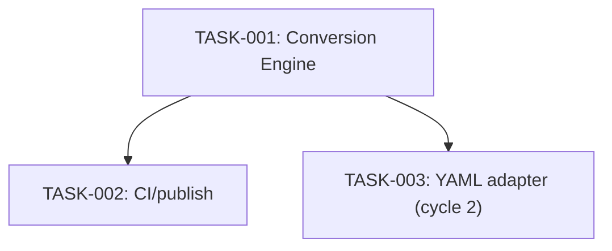

# Implementation Plan

## Definition of Done
Tests pass (per [Testing](../12-testing/testing.md)), code reviewed, README updated if user-facing behavior changed.

## Sequence

| Task | Depends on | Parallelizable with |
|---|---|---|
| TASK-001 | (none) | — |
| TASK-002 | TASK-001 | — |
| TASK-003 | TASK-001 | TASK-002 |

TASK-001 (Conversion Engine) has no dependencies, first. TASK-002 (CI/publish pipeline) depends on TASK-001 existing to have something to test and publish. TASK-003 (YAML adapter) depends on TASK-001 (extends the existing engine); it can happen any time after TASK-001, including in parallel with TASK-002 since they don't touch the same code.

