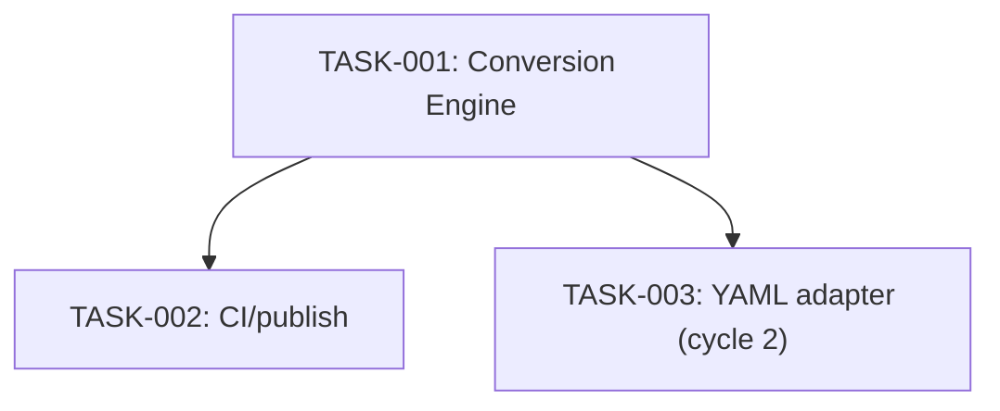

# Implementation Plan

## Definition of Done
Tests pass, code reviewed, README updated if user-facing behavior changed.

## Sequence
1. TASK-001 (Conversion Engine) — no dependencies, first.
2. TASK-002 (CI/publish pipeline) — depends on TASK-001 existing to have something to test and publish.
3. TASK-003 (YAML adapter) — depends on TASK-001 (extends the existing engine); can happen any time after TASK-001, including in parallel with TASK-002 since they don't touch the same code.

